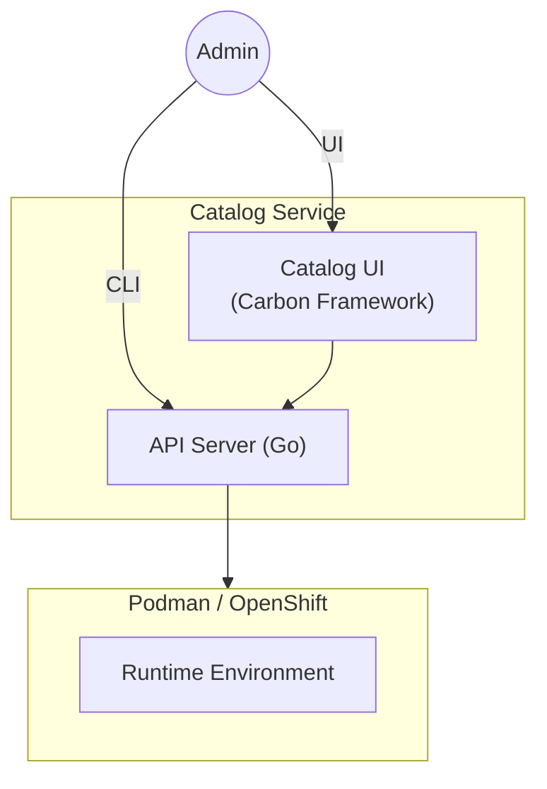
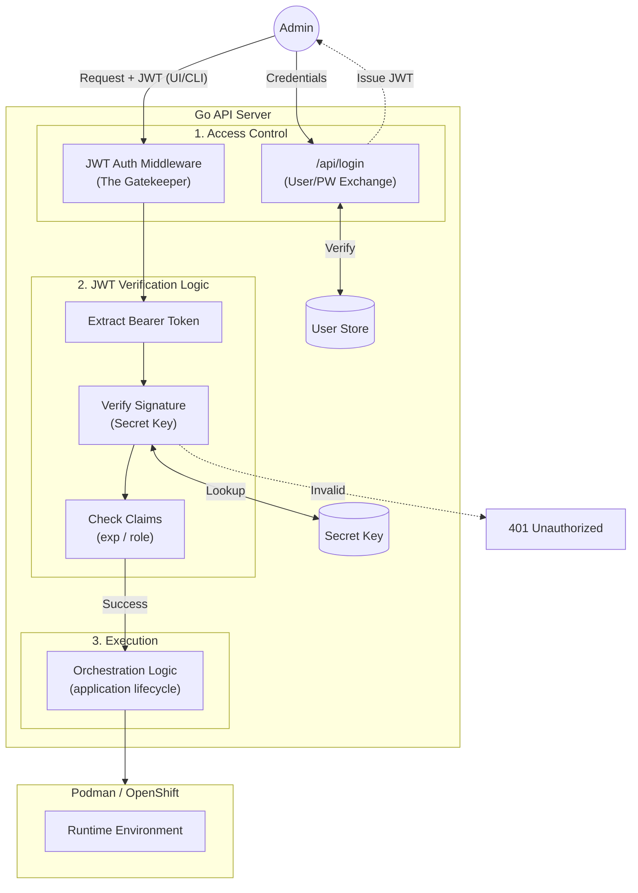
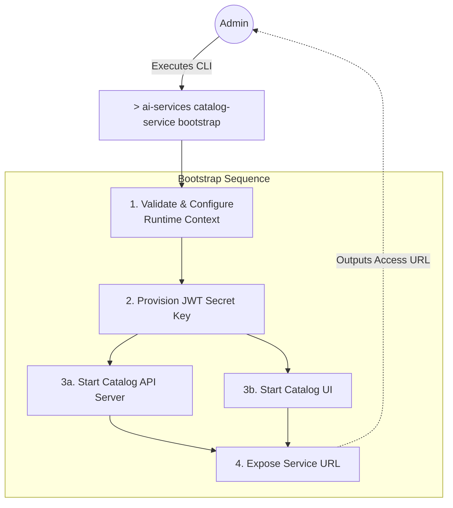

# Design Proposal: Catalog UI & Orchestration Service

**Subject:** Secure Enterprise Interface for IBM AI Services

**Target Platform:** RHEL LPAR (Standalone) / OpenShift (Clustered)

**Status:** Draft / Proposal

---

## 1. Executive Summary

The **Catalog UI Service** provides a centralized, authenticated web portal for managing the lifecycle of AI applications. By providing a high-fidelity interface, the service empowers users to discover application templates, **deploy AI services with one click**, and monitor real-time logs through a stable REST façade. This architecture eliminates the need for manual CLI interaction, providing a secure, single-origin experience for the enterprise.

## 2. Service Architecture

The architecture is centered on the **Catalog UI** as the entry point, utilizing a specialized Go API Server to handle orchestration and security.

* **Catalog UI (Carbon Framework)**: A frontend built with IBM’s Carbon Design System, providing a professional and accessible interface for template browsing and app management.
* **Go API Server (Orchestrator)**: A compiled, high-concurrency backend responsible for identity management, request validation, and the execution of orchestration logic.
* **AI Services Runtime**: The underlying infrastructure layer (Podman on LPAR or Kubernetes on OpenShift) that hosts vLLM inference servers and vector databases.



## 3. Core Functional Capabilities

The Catalog UI transforms manual workflows into automated, repeatable processes:

* **Template Discovery**: A curated library of AI application templates, allowing users to browse pre-configured models and RAG (Retrieval-Augmented Generation) stacks.

* **Accelerated Deployment**: A "One-Click" deployment flow that automates container AI Services provisioning and service exposer.

* **Lifecycle Observability**: Integrated real-time log streaming and status monitoring, providing immediate feedback on AI services health and resource utilization.

## 4. Security Framework (JWT Authentication)

Security is managed at the Catalog UI Service level through a robust JWT-based authentication system.

* **Authentication:** The UI captures user credentials and exchanges them with the Go API Server for a signed JWT.
* **JWT Middleware (The Gatekeeper):**
    1.  **Extraction:** Retrieves the Bearer token from the authorization header of every incoming request.
    2.  **Signature Verification:** The server utilizes a locally stored **Secret Key** to validate the token's integrity. If the signature does not match the payload, the request is immediately rejected.
    3.  **Claims Validation:** The middleware inspects expiration timestamps (`exp`) and RBAC roles (e.g., `admin` vs. `viewer`) before authorizing orchestration logic.

> Note: Initially we will start with the admin role implementation and extend it to other roles in the future.



To ensure strict feature and security parity, both the **Catalog UI** and the **CLI** operate as standard clients to the Go API Server, adhering to identical authentication and orchestration protocols.

### CLI Login and Session Management

1. **Authentication:** Users authenticate via the CLI:
    ```bash
    $ ai-services login --username <user> --password <pass>
    ```
2. **Token Retrieval:** The CLI routes the request to the `/api/login` endpoint of the Go API Server.
3. **Secure Storage:** Upon success, the JWT is stored in a local configuration file (e.g., `~/.config/ai-services/config.json`) with restricted file permissions.
4. **Session Persistence:** Subsequent commands automatically inject this token into the `Authorization` header. If the token expires, the CLI prompts the user for a fresh login.

## 5. Service Bootstrapping

To simplify Day 0 operations, administrators utilize a unified initialization command. This command uses a global flag to define the infrastructure context (Standalone vs. Clustered) before executing the bootstrap sequence.

### Management Plane Initialization

The CLI provides dedicated commands to separate the setup of the management plane (UI + Backend) from the deployment of actual AI services (Day 1).

```bash
# Day 0: Initializes the Catalog Service infrastructure on the specified runtime.
$ ai-services catalog-service bootstrap --runtime <podman|openshift>
```

**Execution Flow:**
This command acts as the primary deployment mechanism, automating the orchestration of the management plane based on the provided configuration. When executed, it performs the following sequence:

1. **Runtime Validation:** Parses the `--runtime` flag to configure the orchestration context for either local execution (`podman` on RHEL LPAR) or clustered execution (`openshift`). If an invalid or missing flag is detected, the CLI halts and returns a usage error.
2. **Secret Generation:** Automatically generates, securely stores, and mounts the cryptographic Secret Key required for the Go API Server's JWT validation layer.
3. **Component Deployment:** Concurrently spins up both the **Catalog API Server** and the **Catalog UI** components within the targeted runtime environment.
4. **Network Binding & Routing:** Establishes the secure connection between the UI and API, exposes the frontend port, and returns the live access URL to the administrator.



## 6. Artifacts
The Catalog Service is delivered as a set of portable, enterprise-grade artifacts designed to run identically across standalone RHEL hosts and clustered OpenShift environments.

### 6.1 Container Images

The solution is packaged into two primary container images. These are hosted in a enterprise registry (e.g., ICR) and pulled during the bootstrap phase.

| Image Alias | Image Name | Base OS / Tech Stack | Role |
| --- | --- | --- | --- |
| **API Server** | `catalog-api:v1` | Red Hat UBI 9 (Minimal) / Go | Orchestration, Auth, & Infrastructure Interfacing |
| **Catalog UI** | `catalog-ui:v1` | Red Hat UBI 9 (Nginx or Equivalent) / React | Carbon-based Web Portal & Asset Hosting |

### 6.2 Deployment Specifications

The `ai-services` CLI abstracts the underlying infrastructure by generating the necessary configuration manifests dynamically during the bootstrap process:

**OpenShift:** Orchestration requires the deployment of standard Kubernetes manifests, including Deployments for pod management, Services for internal networking, and Routes for external UI exposure.

**Podman:** Orchestration utilizes a simplified Pod deployment model, grouping the API and UI containers into a single unit on the RHEL host
