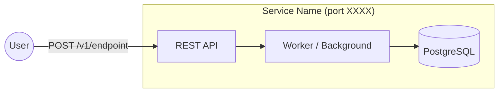
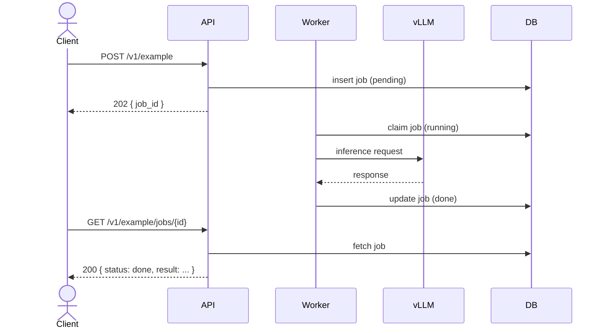

# [Component / Feature Name] — [Document Type]
<!--
  Document types used in this project:
    Design Plan          → a feature or configuration change within a known component
    Implementation Proposal → a new microservice or endpoint being introduced
    High-Level Design    → infrastructure, architecture, or cross-cutting system change
    Service Plan         → a new catalog service (standalone container + assets)
    Design Proposal      → a focused proposal for a well-scoped feature (< 5 files changed)
    Executive Brief      → leadership-facing one-pager (no code, no diagrams)
    Release Plan         → a quarter-scoped delivery plan across multiple pillars

  Replace the title above with the component/feature name and the appropriate type.
  Delete this comment block before committing.
-->

<!--
  METADATA BLOCK — fill in before opening a PR; delete this comment
  Author:       @github-handle
  Reviewers:    @handle1 @handle2
  Status:       Draft | In Review | Accepted | Superseded by [PROPOSAL_XXX.md]
  Jira Epic:    AISERVICES-XXXX
  Created:      YYYY-MM-DD
  Last updated: YYYY-MM-DD
-->

---

## Overview

<!--
  Two to four sentences.  Answer:
    - What problem does this proposal solve?
    - What is the proposed solution at the highest level?
    - Who or what is affected?

  For infrastructure or cross-cutting changes, also state:
    **Goal:** one-line goal statement (bold)
    **Scope:** bullet list of what IS included
    **Non-Goals:** bullet list of what is explicitly excluded (can also be a dedicated section)
-->

**Goal:** <!-- one-line goal statement -->

**Scope:**

- <!-- bullet 1 -->
- <!-- bullet 2 -->

**Non-Goals:**

- <!-- item 1 — be explicit; reviewers read this first -->
- <!-- item 2 -->

---

## 1. Problem Statement

<!--
  Describe the current state and why it is inadequate.
  - Be concrete: reference specific files, endpoints, or parameters that are broken/missing.
  - Use a table to compare current vs. desired when multiple parameters are involved.
  - List pain points as a numbered or bulleted list so reviewers can map solutions back to them.
  - Do NOT include the solution here; keep problem and solution separate.
-->

### Current pain points

1. <!-- specific, concrete issue — reference files/symbols where possible -->
2.
3.

---

## 2. Proposed Solution

<!--
  High-level description of the solution BEFORE diving into details.
  - One or two paragraphs of prose, then diagrams/tables.
  - For infrastructure changes, include a Mermaid topology or sequence diagram here.
  - For API changes, include the endpoint table (path, method, use case).
  - Subsections (2.1, 2.2 …) for each major variant, profile, or option if applicable.
-->

```mermaid
<!-- replace with architecture, flow, or topology diagram -->
graph LR
    A["Component A"] --> B["Component B"]
```

### 2.1 <!-- Sub-topic or option A -->

<!-- detail -->

### 2.2 <!-- Sub-topic or option B (delete if not needed) -->

<!-- detail -->

---

## 3. Architecture

<!--
  Present the system as it will look AFTER the change.
  - Use a Mermaid diagram (graph LR / flowchart TB / sequenceDiagram).
  - Label every node with its port or protocol if networking is involved.
  - Show external systems (vLLM, PostgreSQL, S3, ManageIQ) explicitly.
  - For new services, show the full pod layout (containers, volumes, init containers).
-->



---

## 4. Endpoints / Interface

<!--
  For microservice proposals: list every endpoint with path, method, sync/async, and one-line purpose.
  For infrastructure proposals: show the gRPC proto, CLI commands, or config keys changed.
  For configuration / profile proposals: show the parameter table.

  Use a table and then add a subsection (4.1, 4.2 …) per endpoint/command with full spec.
-->

| Path | Method | Mode | Description |
|:-----|:-------|:-----|:------------|
| `/v1/example` | POST | Sync | <!-- purpose --> |
| `/v1/example/jobs` | POST | Async | <!-- purpose --> |
| `/health` | GET | Sync | Health check |

### 4.1 `POST /v1/example` — <!-- Short name -->

**Request**

```json
{
  "field_name": "string",
  "optional_field": 42
}
```

**Response (200)**

```json
{
  "data": {},
  "meta": {}
}
```

**Error responses**

| Status | Condition |
|:-------|:----------|
| 400 | <!-- invalid input --> |
| 422 | <!-- validation failure --> |
| 500 | <!-- internal error --> |

---

## 5. Implementation Details

<!--
  Low-level detail for implementors.
  Subsections should cover the components introduced or modified.
  Each subsection should answer: what does this component do, and why is it designed this way?

  Typical subsections (use what applies, delete what doesn't):
    5.1  Directory / package layout
    5.2  Database schema (tables, columns, indexes)
    5.3  Key algorithms (context-window guard, chunking, concurrency limiting)
    5.4  Configuration / environment variables
    5.5  Security design (auth, mTLS, token lifecycle)
    5.6  Concurrency model (semaphores, queues, dispatchers)
    5.7  Recovery / restart behaviour
-->

### 5.1 Directory / Package Layout

```
path/to/component/
├── file_a.ext          ← one-line annotation
├── file_b.ext          ← one-line annotation
└── sub/
    └── file_c.ext
```

### 5.2 Database Schema

```sql
CREATE TABLE example_table (
    id          UUID PRIMARY KEY DEFAULT gen_random_uuid(),
    status      TEXT NOT NULL CHECK (status IN ('pending','running','done','failed')),
    created_at  TIMESTAMPTZ NOT NULL DEFAULT now(),
    updated_at  TIMESTAMPTZ NOT NULL DEFAULT now()
);
```

### 5.3 Key Algorithm / Design Decision

<!-- explain the algorithm, formula, or decision; use numbered steps or pseudocode if helpful -->

### 5.4 Environment Configuration

| Variable | Default | Description |
|:---------|:--------|:------------|
| `OPENAI_BASE_URL` | — | vLLM endpoint (required) |
| `MODEL_NAME` | — | Model identifier (required) |
| `DATABASE_URL` | — | PostgreSQL DSN (required) |

---

## 6. End-to-End Flow

<!--
  One sequence diagram showing the happy path from user request to final response.
  For async jobs, show both submission and polling flows.
-->



---

## 7. Files to Create / Modify

<!--
  Exhaustive checklist of every file that will be created or modified.
  Format: checkboxes so the PR author can track progress.
  Group by: New files | Modified files | Deleted files.

  For new catalog services, always include:
    - metadata.yaml (service catalog entry)
    - podman/metadata.yaml (runtime metadata)
    - values.yaml (default configuration)
    - values.schema.json (JSON Schema for UI/validation)
    - podman/templates/*.yaml.tmpl (pod template)
    - Python service files (app.py, Containerfile, requirements.txt)
    - services/Makefile (build target)
-->

### New files

- [ ] `path/to/new/file.ext` — <!-- one-line purpose -->

### Modified files

- [ ] `path/to/existing/file.ext` — <!-- what changes -->

### Deleted files

- [ ] `path/to/removed/file.ext` — <!-- why removed -->

---

## 8. Verification Plan

<!--
  List the specific checks that confirm the change works correctly.
  Be concrete — "run X, expect Y" — so a reviewer can reproduce each step.
  Include both happy-path and error-path checks.
-->

1. <!-- step 1: build / lint -->
2. <!-- step 2: unit test -->
3. <!-- step 3: integration smoke test (e.g., curl command + expected output) -->
4. <!-- step 4: error-path test (e.g., invalid input returns 422) -->
5. <!-- step 5: regression check (existing tests still pass) -->

---

## 9. What Is NOT in Scope

<!--
  Explicit out-of-scope items prevent scope creep in review and implementation.
  List anything a reader might reasonably expect but that is deferred or excluded.
  Cross-reference a future-work item if one exists.
-->

- **OpenShift / Kubernetes support:** Separate design required; not addressed here.
- **Horizontal scaling:** Single-replica deployment only; multi-replica contention is deferred.
- **UI:** Service is API-only; no frontend work is included.
- **<!-- item -->:** <!-- reason for deferral -->

---

## 10. Future Work

<!--
  Optional section. Include only if there are concrete follow-on items.
  Link to a Jira issue or a follow-up proposal when one exists.
-->

- <!-- item 1 (Jira: AISERVICES-XXXX) -->
- <!-- item 2 -->

---

## 11. Open Questions

<!--
  Optional section. List questions that must be resolved before implementation starts,
  or design decisions that are still open for discussion.
  Format: numbered list, each item ending with a `> Decision:` line for tracking.
-->

1. <!-- question -->
   > **Decision:** <!-- pending / answer -->

2. <!-- question -->
   > **Decision:** <!-- pending / answer -->

---

<!--
  ─────────────────────────────────────────────────────────────────────────────
  AUTHORING CHECKLIST — delete this entire block before committing
  ─────────────────────────────────────────────────────────────────────────────

  Before opening a PR for this proposal, confirm:

  [ ] Title follows the pattern: "[Component] — [Document Type]"
  [ ] Metadata block (author, reviewers, status, Jira epic) is filled in
  [ ] Problem Statement is purely descriptive — no solution leaks in
  [ ] All Mermaid diagrams render correctly (preview in GitHub or VS Code)
  [ ] Every endpoint has a full request + response example
  [ ] Files to Create/Modify is exhaustive — nothing left as "TBD"
  [ ] Non-Goals and What Is NOT in Scope sections are present
  [ ] No placeholder comments remain in the committed document
  [ ] PDF export generated (if required for stakeholder distribution)

  Section inclusion guide by document type:

  | Section               | Design Plan | Impl Proposal | HLD | Service Plan | Exec Brief |
  |:----------------------|:-----------:|:-------------:|:---:|:------------:|:----------:|
  | Overview / Goal       | ✓           | ✓             | ✓   | ✓            | ✓          |
  | Problem Statement     | ✓           | ✓             | ✓   | ✓            | ✓          |
  | Proposed Solution     | ✓           | ✓             | ✓   | ✓            | ✓          |
  | Architecture diagram  | optional    | ✓             | ✓   | ✓            | —          |
  | Endpoints / Interface | optional    | ✓             | ✓   | optional     | —          |
  | Implementation Detail | optional    | ✓             | ✓   | ✓            | —          |
  | End-to-End Flow       | optional    | ✓             | ✓   | optional     | —          |
  | Files to Create       | ✓           | ✓             | ✓   | ✓            | —          |
  | Verification Plan     | ✓           | ✓             | ✓   | ✓            | —          |
  | Not in Scope          | ✓           | ✓             | ✓   | ✓            | optional   |
  | Future Work           | optional    | optional      | ✓   | optional     | —          |
  | Open Questions        | optional    | optional      | ✓   | optional     | —          |
  ─────────────────────────────────────────────────────────────────────────────
-->
