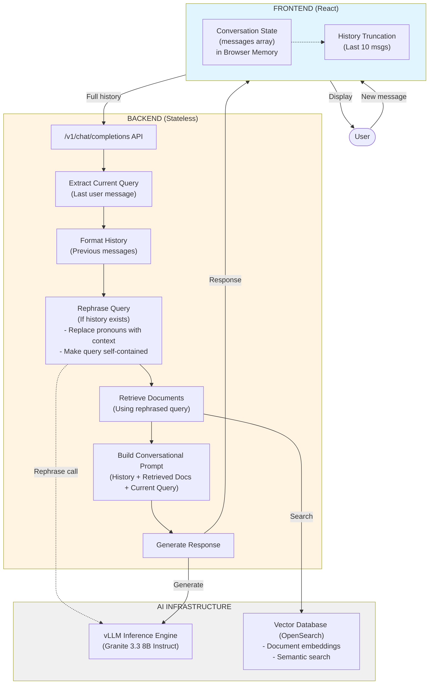
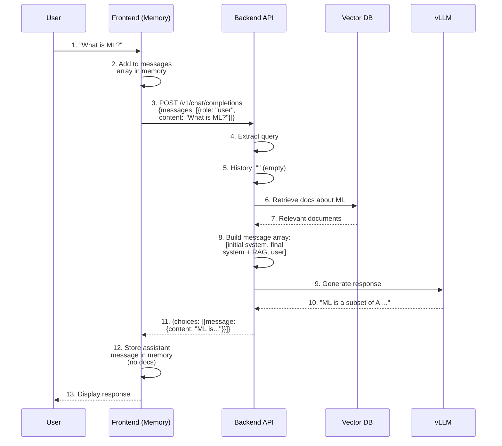
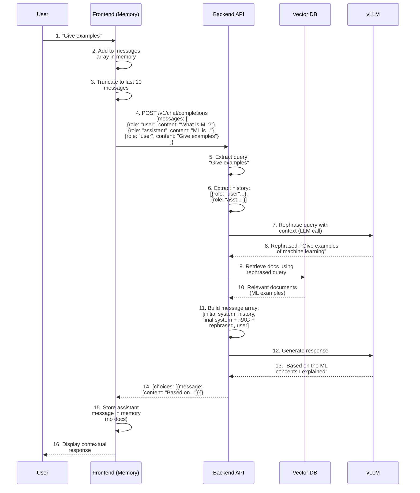

# Design Proposal: Conversational RAG with Client-Side Session Management

---

## 1. Executive Summary

The **Conversational RAG Enhancement** transforms the existing single-turn RAG chatbot into a multi-turn conversational system capable of maintaining context across multiple exchanges. By implementing a **client-side stateless architecture**, the system enables natural follow-up questions, pronoun resolution, and contextual understanding while maintaining 100% OpenAI API compatibility and backend statelessness. This design eliminates server-side session management complexity, ensures horizontal scalability, and provides a seamless upgrade path for existing deployments.

## 2. Current State Analysis

### 2.1 Existing Architecture

The current RAG chatbot operates in a **stateless, single-turn mode**:

* **Request Flow**: User sends a query → Backend retrieves documents → LLM generates response
* **No Context Retention**: Each request is independent; no conversation history is maintained
* **OpenAI Compatible**: Uses standard `/v1/chat/completions` endpoint with `messages` array
* **Limitation**: Cannot handle follow-up questions like "Can you explain more?" or "What about the second point?"

### 2.2 User Experience Gap

**Current Behavior:**
```
User: "What is machine learning?"
Bot: [Detailed explanation about ML]

User: "Can you give examples?"
Bot: [Generic examples, no reference to previous answer]
```

**Desired Behavior:**
```
User: "What is machine learning?"
Bot: [Detailed explanation about ML]

User: "Can you give examples?"
Bot: "Based on the machine learning concepts I just explained, here are some examples..."
```

## 3. Proposed Architecture

### 3.1 Design Philosophy

The solution adopts a **client-side session management** approach with a **stateless backend**, where:

* **Backend**: Remains completely stateless, no session storage
* **Frontend**: Manages conversation message history in browser memory, excluding retrieved document payloads
* **API**: Pure OpenAI standard, no modifications to request/response format
* **Scalability**: Truly stateless backend enables unlimited horizontal scaling



### 3.2 Session Management: Server-Side vs Client-Side Analysis

#### 3.2.1 Server-Side Session Management

**Approach:** Backend stores conversation history in a session store (Redis, database, or in-memory cache).

**Pros:**
* **Smaller Request Payloads**: Only current query sent to backend, reducing network bandwidth
* **Centralized Control**: Server manages history truncation, cleanup, and retention policies
* **Cross-Device Access**: Users can resume conversations from different devices/browsers
* **Analytics & Monitoring**: Easier to track conversation patterns, quality metrics, and user behavior
* **Security**: Sensitive conversation data never leaves the server infrastructure
* **Conversation Sharing**: Simpler to implement shared or collaborative conversations

**Cons:**
* **Infrastructure Complexity**: Requires session storage (Redis, Memcached, or database)
* **Scalability Challenges**: Session affinity (sticky sessions) needed or distributed session store
* **Operational Overhead**: Session cleanup, expiration policies, storage management
* **Deployment Complexity**: Additional components to deploy, monitor, and maintain
* **State Management**: Backend becomes stateful, complicating horizontal scaling
* **Cost**: Additional infrastructure costs for session storage and management
* **Single Point of Failure**: Session store becomes critical dependency

#### 3.2.2 Client-Side Conversation Handling

**Approach:** Frontend keeps the current conversation history only in browser memory for the active page session, while the backend remains stateless and uses no session IDs or session storage.

**Pros:**
* **True Statelessness**: Backend remains completely stateless, enabling unlimited horizontal scaling
* **Zero Infrastructure**: No session storage, Redis, or database required
* **Simplified Deployment**: No additional components to deploy or manage
* **Cost Effective**: No infrastructure costs for session management
* **Privacy-Focused**: Conversation data stays in user's browser, never stored server-side
* **Resilient**: No session store dependency, no single point of failure
* **OpenAI Compatible**: Pure standard API, works with existing tools and clients
* **Fast Implementation**: Minimal backend changes, faster time to production

**Cons:**
* **Larger Request Payloads**: Full conversation history sent with each request (~2-3KB for 10 messages)
* **Client Complexity**: Frontend must manage in-memory state and truncation
* **Limited Analytics**: Server-side conversation tracking requires additional instrumentation
* **Refresh Loss**: Conversation history is lost on page refresh, restart, or tab close by design
* **No Server-Side History**: Cannot implement server-side conversation search or archival

#### 3.2.3 Decision Rationale: Why Client-Side Was Chosen

For this RAG chatbot implementation, **client-side conversation handling with a stateless backend** was selected based on the following critical factors:

**1. Deployment Simplicity**
* Target platforms (RHEL LPAR standalone, OpenShift clustered) benefit from minimal infrastructure
* No need to deploy, configure, or maintain Redis/Memcached clusters
* Reduces operational burden for enterprise deployments

**2. True Horizontal Scalability**
* Stateless backend scales infinitely without session affinity concerns
* Load balancers can distribute requests freely across any backend instance
* Critical for OpenShift deployments with auto-scaling requirements

**3. OpenAI API Compatibility**
* Maintains 100% compatibility with OpenAI's `/v1/chat/completions` standard
* Existing tools, SDKs, and clients work without modification
* Future-proof design aligned with industry standards

**4. Acceptable Trade-offs**
* Request payload increase (~2-3KB for 10 messages) is negligible for modern networks
* Conversation history of 10 messages fits comfortably within typical HTTP request limits
* Conversation state is intentionally ephemeral and resets on refresh or restart

**5. User Privacy**
* Conversations never leave user's browser unless explicitly sent to backend
* No server-side logging or storage of conversation history
* Aligns with privacy-first design principles

**6. Rapid Implementation**
* Minimal backend changes (~100 LOC)
* No new infrastructure components
* Faster time to production

**7. Cost Efficiency**
* Zero additional infrastructure costs
* No session storage licensing or hosting fees
* Reduced operational costs (no session store monitoring/maintenance)

### 3.3 Key Architectural Decisions

| Decision | Choice | Rationale |
|----------|--------|-----------|
| **Session Management** | Client-side | No backend state, unlimited scalability |
| **API Compatibility** | Pure OpenAI standard | No breaking changes, ecosystem compatibility |
| **History Storage** | Frontend (Browser Memory) | Ephemeral by design, resets on refresh, user-controlled |
| **History Truncation** | Frontend (Last 10 messages) | Sliding window logic to max out context window |
| **Retrieved Documents** | Not stored in conversation history | Only message content stored; docs retrieved fresh each turn |
| **Prompt Format** | Simple text format | Minimal tokens, easy to read |

## 4. Core Functional Capabilities

### 4.1 Multi-Turn Conversation Support

The system enables natural conversational flows:

* **Follow-up Questions**: "Tell me more about that" references previous context
* **Pronoun Resolution**: "What about it?" understands the subject from history
* **Topic Continuity**: Maintains coherent discussion across multiple turns
* **Context Switching**: Gracefully handles topic changes within conversation

### 4.2 Ephemeral Conversation State

* **In-Memory Only**: Conversation messages exist only in browser memory for the current page session
* **Refresh Resets State**: A page refresh, restart, or tab close clears the conversation by design
* **Simple Client-Side Handling**: No session IDs, no session lifecycle management, and no browser persistence layer
* **Privacy-Focused**: Conversation messages are not stored server-side; retrieved documents are not persisted in history
* **Fresh Retrieval Per Turn**: Each turn performs a new vector database retrieval; retrieved documents are used only for that turn's prompt construction

### 4.3 Intelligent Context Management

* **Sliding Window**: Maintains last 10 messages (5 turns) for optimal context
* **Token Budget**: Allocates context window efficiently:
  - System prompt/instructions: ~300 tokens
  - Conversation history (messages only, no docs): ~2,000 tokens
  - Retrieved documents (current turn only): ~3,000 tokens
  - Current query: ~512 tokens
  - Total input budget: ~5,812 tokens

## 5. Implementation Details

### 5.1 Backend Changes (Minimal)

#### 5.1.1 New Utility Module: `conversation_utils.py`

**Important Design Principle:**
- **Frontend sends**: ONLY clean user/assistant message pairs (no system prompts)
- **Backend adds**: System prompts dynamically for each turn (not stored in history)
- **Next turn extraction**: Simple - just filter messages by role="user" and role="assistant"

This makes it trivial to extract conversation history for the next turn because the frontend never includes system prompts in the messages array it sends.

```python
def get_conversation_context(messages):
    """
    Extract current query and conversation history from incoming messages.
    
    IMPORTANT: The messages array from the frontend contains ONLY user/assistant pairs.
    System prompts are NEVER included in the conversation history sent by the frontend.
    
    Args:
        messages: List of message objects in OpenAI format from frontend
                 [{"role": "user", "content": "What is X?"},
                  {"role": "assistant", "content": "X is..."},
                  {"role": "user", "content": "Tell me more"}]
                 
                 Note: No system messages are present - they're added by backend per turn
    
    Returns:
        tuple: (current_query: str, previous_messages: list)
               - current_query: The latest user question (clean)
               - previous_messages: Clean Q&A history in OpenAI format
                                   (ready to be used in next turn)
    """
    if not messages or len(messages) == 0:
        return "", []
    
    # Last message should be the current user query (clean question from UI)
    current_message = messages[-1]
    current_query = current_message.get("content", "")
    
    # Everything before the last message is conversation history
    # This is already clean user/assistant pairs - no filtering needed!
    previous_messages = messages[:-1] if len(messages) > 1 else []
    
    return current_query, previous_messages


def format_messages_for_rephrasing(messages):
    """
    Format conversation messages into a readable string for query rephrasing.
    Only used for the rephrasing LLM call, not for the main RAG response.
    
    Args:
        messages: List of message objects in OpenAI format
    
    Returns:
        Formatted string for rephrasing context
    """
    if not messages:
        return ""
    
    history_lines = []
    for msg in messages:
        role = msg.get("role", "")
        content = msg.get("content", "")
            
        # Format as "User: ..." or "Assistant: ..."
        role_label = "User" if role == "user" else "Assistant"
        history_lines.append(f"{role_label}: {content}")
    
    return "\n".join(history_lines)

#### 5.1.1.1 Query Rephrasing for Context-Aware Retrieval

**Problem Statement:**

In conversational RAG, the current query often contains pronouns, references, or implicit context that makes it unsuitable for direct vector database retrieval.

**Example Scenario:**
```
Q: "What is Spyre?"
A: "Spyre is an AI accelerator for Power hardware..."
Q: "Is this supported on Power 11?"
```

If we search the vector DB with "Is this supported on Power 11?", we won't get relevant results because:
- "this" is ambiguous (refers to Spyre from previous context)
- The query lacks the subject needed for semantic search
- Vector embeddings won't capture the conversational reference

**Solution: LLM-Based Query Rephrasing**

Before retrieval, use the LLM to rephrase the current query by incorporating conversation context.

**References:**
- [LlamaIndex Chat Engine - Condense Question Mode](https://developers.llamaindex.ai/python/examples/chat_engine/chat_engine_condense_question/)
- [RAG Chatbot System - Paolo Astrino (University of Venice)](https://unitesi.unive.it/bitstream/20.500.14247/26369/1/RAG_Chatbot_System_PaoloAstrino.pdf)
- [Query Rewriting for Conversational Search (EACL 2026)](https://aclanthology.org/2026.eacl-srw.17.pdf)

**Implementation:**

```python
async def rephrase_query_with_context(current_query: str, previous_messages: list) -> str:
    """
    Rephrase the current query to be self-contained using conversation context.
    
    Args:
        current_query: The latest user question (may contain pronouns/references)
        previous_messages: Previous conversation messages in OpenAI format
                          [{"role": "user", "content": "..."}, {"role": "assistant", "content": "..."}]
    
    Returns:
        A standalone, search-optimized query
    """
    # Skip rephrasing if no conversation history
    if not previous_messages or len(previous_messages) == 0:
        return current_query
    
    # Format conversation history for rephrasing context
    conversation_history = format_messages_for_rephrasing(previous_messages)
    
    # Build rephrasing prompt
    rephrase_prompt = f"""Given the conversation history and the current question, rephrase the current question to be a standalone, self-contained query that can be used for semantic search. The rephrased query should:
1. Replace pronouns (this, that, it, they) with specific nouns from context
2. Include all necessary context to understand what is being asked
3. Be concise and focused on the search intent
4. Maintain the original question's meaning

Conversation History:
{conversation_history}

Current Question: {current_query}

Rephrased Query (respond with ONLY the rephrased query, no explanation):"""

    # Call LLM for rephrasing (fast, small model preferred)
    rephrased = await call_llm_for_rephrasing(
        prompt=rephrase_prompt,
        max_tokens=100,  # Keep it short
        temperature=0.0  # Deterministic
    )
    
    # Fallback to original if rephrasing fails
    if not rephrased or len(rephrased.strip()) == 0:
        logger.warning("Query rephrasing failed, using original query")
        return current_query
    
    logger.info(f"Original query: {current_query}")
    logger.info(f"Rephrased query: {rephrased}")
    
    return rephrased.strip()


async def call_llm_for_rephrasing(prompt: str, max_tokens: int, temperature: float) -> str:
    """
    Call vLLM endpoint for query rephrasing.
    Uses the same vLLM endpoint but with minimal tokens.
    """
    payload = {
        "model": settings.llm_model,
        "prompt": prompt,
        "max_tokens": max_tokens,
        "temperature": temperature,
        "stop": ["\n\n", "Question:", "Current Question:"]
    }
    
    async with httpx.AsyncClient(timeout=30.0) as client:
        response = await client.post(
            f"{settings.llm_endpoint}/v1/completions",
            json=payload
        )
        response.raise_for_status()
        result = response.json()
        return result["choices"][0]["text"]
```

**Example Transformations:**

| Original Query | Conversation Context | Rephrased Query |
|----------------|---------------------|-----------------|
| "Is this supported on Power 11?" | Previous: "What is Spyre?" → "Spyre is an AI accelerator..." | "Is Spyre supported on Power 11?" |
| "How do I install it?" | Previous: "What is OpenShift?" | "How do I install OpenShift?" |

**Performance Considerations:**

1. **Latency Impact**: Adds ~200-500ms per query (LLM call)
   - Acceptable trade-off for accuracy improvement

2. **Token Cost**: Minimal (~50-150 tokens per rephrasing)
   - Much cheaper than full RAG response
   - Can use smaller model for rephrasing

**Configuration:**

Add to `settings.json`:
```json
{
  "query_rephrasing": {
    "enabled": true,
    "skip_if_no_history": true,
    "rephrase_timeout_seconds": 5,
    "fallback_to_original_on_error": true
  }
}
```

#### 5.1.2 Modified `app.py` - Chat Completion Endpoint

**Key Changes:**
1. Validate incoming messages follow OpenAI format
2. Rephrase query using conversation context for better retrieval
3. Pass structured messages AND rephrased query to LLM
4. Maintain OpenAI-compatible request/response format

```python
from chatbot.conversation_utils import (
    get_conversation_context,
    validate_message_format,
    rephrase_query_with_context
)

@app.post("/v1/chat/completions")
async def chat_completion(req: ChatCompletionRequest):
    """
    OpenAI-compatible chat completion endpoint with RAG.
    
    Request format:
    {
        "messages": [
            {"role": "user", "content": "What is Spyre?"},
            {"role": "assistant", "content": "Spyre is..."},
            {"role": "user", "content": "Is it supported on Power 11?"}
        ],
        "stream": true
    }
    """
    
    # Extract current query and previous conversation messages
    # previous_messages maintains OpenAI format: [{"role": "...", "content": "..."}]
    current_query, previous_messages = get_conversation_context(req.messages)
    
    # Rephrase query for better retrieval (if conversation history exists)
    rephrased_query = await rephrase_query_with_context(
        current_query=current_query,
        previous_messages=previous_messages
    )
    
    # Retrieve documents using the rephrased query
    docs, perf_stats = await retrieve_and_rerank(rephrased_query)
    
    # Generate response with structured message history
    # Pass previous_messages as list, not flattened string
    # Pass rephrased_query to be included in final system prompt
    response = await query_llm(
        query=current_query,
        documents=docs,
        previous_messages=previous_messages,  # OpenAI format list
        rephrased_query=rephrased_query,      # For RAG system prompt
        stream=req.stream,
        ...
    )
    
    return response
```

#### 5.1.3 Modified `llm_utils.py` - Prompt Building with OpenAI Message Format

**Key Changes:**
1. Build proper message array following official OpenAI logic
2. Initial system prompt for conversational behavior at the beginning
3. Conversation history as clean user/assistant pairs in the middle
4. Final system prompt with RAG context and rephrased query before current question
5. Allocate token budget for messages + current-turn documents

**Important Design Decision:**
- System prompts are NOT stored in conversation history
- Each turn uses TWO system messages: initial (conversational) + final (RAG context)
- Only clean user questions and assistant answers are stored in history
- The final system prompt contains the rephrased query for better context understanding

```python
def query_vllm_payload(question, documents, llm_endpoint, llm_model,
                      previous_messages=None, rephrased_query=None, ...):
    """
    Build vLLM payload with OpenAI-compatible message format.
    
    Args:
        question: Current user query (original)
        documents: Retrieved documents for RAG context (fresh for this turn)
        previous_messages: [{"role": "user", "content": "What is X?"},
                           {"role": "assistant", "content": "X is..."}]
        rephrased_query: Contextualized query used for retrieval
    
    Returns:
        Message array: [initial_system, ...history, final_system, current_user]
    """
    
    # Prepare RAG context from retrieved documents (fresh for this turn)
    context = "\n\n".join([doc.get("page_content") for doc in documents])
    
    # Calculate token budget
    question_tokens = len(tokenize_with_llm(question, llm_endpoint))
    
    history_tokens = 0
    if previous_messages:
        for msg in previous_messages:
            history_tokens += len(tokenize_with_llm(msg.get("content", ""), llm_endpoint))
    
    # Reserve tokens for both system messages
    initial_system_overhead = 100  # "You are a helpful conversational assistant"
    final_system_overhead = 200    # RAG context + instructions
    
    remaining_tokens = settings.max_input_length - (
        initial_system_overhead +
        final_system_overhead +
        question_tokens +
        history_tokens
    )
    
    # Truncate context to fit budget
    context = detokenize_with_llm(
        tokenize_with_llm(context, llm_endpoint)[:remaining_tokens],
        llm_endpoint
    )
    
    # Build message array in OpenAI format
    message_array = []
    
    # 1. Initial system prompt - conversational behavior
    initial_system_content = settings.prompts.initial_system_message
    message_array.append({
        "role": "system",
        "content": initial_system_content
    })
    
    # 2. Conversation history (if exists)
    if previous_messages:
        message_array.extend(previous_messages)
    
    # 3. Final system prompt - RAG context with rephrased query
    # This is regenerated for EVERY turn with new retrieved documents
    final_system_content = settings.prompts.rag_system_message.format(
        context=context,
        rephrased_query=rephrased_query or question
    )
    message_array.append({
        "role": "system",
        "content": final_system_content
    })
    
    # 4. Current user question
    message_array.append({
        "role": "user",
        "content": question
    })
    
    payload = {
        "model": llm_model,
        "messages": message_array,  # OpenAI format
        "temperature": settings.temperature,
        "max_tokens": settings.max_output_length,
        "stream": True
    }
    
    return headers, payload
```

**Example Message Flow:**

**Turn 1 - First Question:**

UI sends (clean question only):
```json
{
  "messages": [
    {
      "role": "user",
      "content": "What is Spyre?"
    }
  ]
}
```

Backend builds message array following official OpenAI logic:
```json
{
  "messages": [
    {
      "role": "system",
      "content": "You are a helpful, conversational AI assistant. Engage naturally with users and provide clear, accurate responses."
    },
    {
      "role": "system",
      "content": "Retrieved Context:\n[Fresh RAG docs about Spyre]\n\nRephrased Query: What is Spyre?\n\nInstructions: Answer the user's question based on the retrieved context above. Be conversational and reference the context when relevant."
    },
    {
      "role": "user",
      "content": "What is Spyre?"
    }
  ]
}
```

**Turn 2 - Follow-up Question:**

UI sends (clean questions + history):
```json
{
  "messages": [
    {
      "role": "user",
      "content": "What is Spyre?"
    },
    {
      "role": "assistant",
      "content": "Spyre is an AI accelerator for Power hardware..."
    },
    {
      "role": "user",
      "content": "Is it supported on Power 11?"
    }
  ]
}
```

Backend builds message array following official OpenAI logic:
```json
{
  "messages": [
    {
      "role": "system",
      "content": "You are a helpful, conversational AI assistant. Engage naturally with users and provide clear, accurate responses."
    },
    {
      "role": "user",
      "content": "What is Spyre?"
    },
    {
      "role": "assistant",
      "content": "Spyre is an AI accelerator for Power hardware..."
    },
    {
      "role": "system",
      "content": "Retrieved Context:\n[Fresh RAG docs about Power 11 support]\n\nRephrased Query: Is Spyre supported on Power 11 systems?\n\nInstructions: Answer the user's question based on the retrieved context above and the conversation history. Be conversational and reference previous exchanges when relevant."
    },
    {
      "role": "user",
      "content": "Is it supported on Power 11?"
    }
  ]
}
```

#### 5.1.4 Updated `settings.json` - System Message Templates

```json
{
  "prompts": {
    "initial_system_message": "You are a helpful, conversational AI assistant. Engage naturally with users, maintain context across the conversation, and provide clear, accurate responses. Be friendly and professional.",
    
    "rag_system_message": "Retrieved Context:\n{context}\n\nRephrased Query: {rephrased_query}\n\nInstructions:\n- Answer the user's question based on the retrieved context above\n- Reference the conversation history when relevant\n- Be conversational and natural in your responses\n- If the context doesn't contain the answer, say so clearly\n- Cite sources from the context when possible\n- The rephrased query shows how the question was interpreted with conversation context",
    
    "initial_system_message_de": "Sie sind ein hilfreicher, gesprächiger KI-Assistent. Interagieren Sie natürlich mit Benutzern, behalten Sie den Kontext über das Gespräch hinweg bei und geben Sie klare, genaue Antworten. Seien Sie freundlich und professionell.",
    
    "rag_system_message_de": "Abgerufener Kontext:\n{context}\n\nUmformulierte Anfrage: {rephrased_query}\n\nAnweisungen:\n- Beantworten Sie die Frage des Benutzers basierend auf dem oben abgerufenen Kontext\n- Verweisen Sie auf die Konversationshistorie, wenn relevant\n- Seien Sie gesprächig und natürlich in Ihren Antworten\n- Wenn der Kontext die Antwort nicht enthält, sagen Sie dies klar\n- Zitieren Sie Quellen aus dem Kontext, wenn möglich\n- Die umformulierte Anfrage zeigt, wie die Frage mit dem Gesprächskontext interpretiert wurde"
  }
}
```

### 5.2 Frontend Changes (Moderate)

#### 5.2.1 New Custom Hook: `useConversation.js`

```javascript
import { useState, useCallback } from 'react';

const MAX_MESSAGES = 10;

export const useConversation = () => {
  const [messages, setMessages] = useState([]);
  const [isLoading, setIsLoading] = useState(false);

  // Truncate to last N messages
  const truncateMessages = useCallback((msgs) => {
    return msgs.length > MAX_MESSAGES ? msgs.slice(-MAX_MESSAGES) : msgs;
  }, []);

  // Send message to API
  const sendMessage = useCallback(async (userMessage) => {
    const newMessages = truncateMessages([
      ...messages,
      { role: 'user', content: userMessage }
    ]);
    setMessages(newMessages);
    setIsLoading(true);

    try {
      const response = await fetch('/v1/chat/completions', {
        method: 'POST',
        headers: { 'Content-Type': 'application/json' },
        body: JSON.stringify({
          messages: newMessages.map(m => ({ role: m.role, content: m.content })),
          temperature: 0.1,
          stream: false,
        }),
      });

      const data = await response.json();
      const assistantMessage = data.choices[0]?.message?.content;

      setMessages(prev => truncateMessages([
        ...prev,
        {
          role: 'assistant',
          content: assistantMessage
        }
      ]));
    } catch (error) {
      console.error('Failed to send message:', error);
    } finally {
      setIsLoading(false);
    }
  }, [messages, truncateMessages]);

  const clearConversation = useCallback(() => {
    setMessages([]);
  }, []);

  return { messages, isLoading, sendMessage, clearConversation };
};
```

#### 5.2.2 New Component: `ChatHistory.jsx`

```jsx
import React from 'react';
import { Tile, Accordion, AccordionItem } from '@carbon/react';

export const ChatHistory = ({ messages }) => {
  return (
    <div className="chat-history">
      {messages.map((msg, idx) => (
        <Tile key={idx} className={`message message--${msg.role}`}>
          <div className="message__role">{msg.role}</div>
          <div className="message__content">{msg.content}</div>
          
          {/* Show retrieved documents for assistant messages */}
          {msg.role === 'assistant' && msg.retrieved_docs && msg.retrieved_docs.length > 0 && (
            <Accordion>
              <AccordionItem title={`View Sources (${msg.retrieved_docs.length})`}>
                <div className="retrieved-docs">
                  {msg.retrieved_docs.map((doc, docIdx) => (
                    <div key={docIdx} className="doc-reference">
                      <strong>{doc.filename}</strong>
                      <p>{doc.page_content.substring(0, 200)}...</p>
                    </div>
                  ))}
                </div>
              </AccordionItem>
            </Accordion>
          )}
        </Tile>
      ))}
    </div>
  );
};
```

**Note:** Retrieved documents are stored with each assistant message, enabling:
- **Transparency**: Users can see which sources were used
- **Debugging**: Developers can verify retrieval quality
- **Future Features**: "View Sources" button, citation links, etc.

#### 5.2.3 New Component: `ConversationControls.jsx`

```jsx
import React from 'react';
import { Button } from '@carbon/react';
import { Renew, TrashCan } from '@carbon/icons-react';

export const ConversationControls = ({ onNewConversation, onClear }) => {
  return (
    <div className="conversation-controls">
      <Button
        kind="secondary"
        renderIcon={Renew}
        onClick={onNewConversation}
      >
        New Conversation
      </Button>
      <Button
        kind="danger--ghost"
        renderIcon={TrashCan}
        onClick={onClear}
      >
        Clear History
      </Button>
    </div>
  );
};
```

#### 5.2.4 Modified `App.jsx` - Integration

```jsx
import { useConversation } from './hooks/useConversation';
import { ChatHistory } from './components/ChatHistory';
import { ConversationControls } from './components/ConversationControls';

function App() {
  const { messages, isLoading, sendMessage, clearConversation } = useConversation();

  return (
    <div className="app">
      <ConversationControls 
        onNewConversation={clearConversation}
        onClear={clearConversation}
      />
      <ChatHistory messages={messages} />
      <ChatInput 
        onSend={sendMessage} 
        disabled={isLoading}
        placeholder="Ask a follow-up question..."
      />
    </div>
  );
}
```

## 6. Request/Response Flow

### 6.1 First Message (No History)

**Frontend Request:**
```json
{
  "messages": [
    {"role": "user", "content": "What is machine learning?"}
  ],
  "temperature": 0.1
}
```

**Backend Processing:**
1. Extract query: "What is machine learning?"
2. Conversation history: [] (empty)
3. No rephrasing needed (first message)
4. Retrieve documents about ML from vector database
5. Build message array:
   - Initial system prompt (conversational behavior)
   - Final system prompt (RAG context + rephrased query)
   - Current user question
6. Generate response

**Message Array Sent to LLM:**
```json
{
  "messages": [
    {
      "role": "system",
      "content": "You are a helpful, conversational AI assistant..."
    },
    {
      "role": "system",
      "content": "Retrieved Context:\n[ML documents]\n\nRephrased Query: What is machine learning?\n\nInstructions: Answer based on context..."
    },
    {
      "role": "user",
      "content": "What is machine learning?"
    }
  ]
}
```

**Backend Response:**
```json
{
  "choices": [
    {
      "message": {
        "content": "Machine learning is a subset of artificial intelligence..."
      }
    }
  ]
}
```

**Frontend Storage:**
The frontend stores only the message exchange (no system prompts or retrieved documents):
```javascript
{
  role: "user",
  content: "What is machine learning?"
}
{
  role: "assistant",
  content: "Machine learning is a subset..."
}
```

### 6.2 Follow-up Message (With History)

**Frontend Request:**
The frontend sends only the conversation message history; it does not include system prompts or previously retrieved documents:
```json
{
  "messages": [
    {"role": "user", "content": "What is machine learning?"},
    {"role": "assistant", "content": "Machine learning is a subset..."},
    {"role": "user", "content": "Can you give examples?"}
  ],
  "temperature": 0.1
}
```

**Backend Processing:**
1. Extract query: "Can you give examples?"
2. Extract history:
   ```
   [
     {"role": "user", "content": "What is machine learning?"},
     {"role": "assistant", "content": "Machine learning is a subset..."}
   ]
   ```
3. **Rephrase query with context**:
   - Original: "Can you give examples?"
   - Rephrased: "Can you give examples of machine learning?"
   - This ensures vector search retrieves relevant ML example documents
4. Retrieve NEW documents using the rephrased query from vector database
5. Build message array:
   - Initial system prompt (conversational behavior)
   - Conversation history (user/assistant pairs)
   - Final system prompt (RAG context + rephrased query)
   - Current user question
6. Generate contextual response

**Message Array Sent to LLM:**
```json
{
  "messages": [
    {
      "role": "system",
      "content": "You are a helpful, conversational AI assistant..."
    },
    {
      "role": "user",
      "content": "What is machine learning?"
    },
    {
      "role": "assistant",
      "content": "Machine learning is a subset..."
    },
    {
      "role": "system",
      "content": "Retrieved Context:\n[NEW ML examples documents]\n\nRephrased Query: Can you give examples of machine learning?\n\nInstructions: Answer based on context and conversation history..."
    },
    {
      "role": "user",
      "content": "Can you give examples?"
    }
  ]
}
```

**Backend Response:**
```json
{
  "choices": [
    {
      "message": {
        "content": "Based on the machine learning concepts I explained, here are some examples..."
      }
    }
  ]
}
```

**Frontend Storage:**
The frontend stores only the message exchange:
```javascript
{
  role: "user",
  content: "Can you give examples?"
}
{
  role: "assistant",
  content: "Based on the machine learning concepts I explained..."
}
```

**Note:** Each turn retrieves fresh documents from the vector database based on the current query. Those retrieved documents are used only for that turn's response generation and are neither stored in conversation history nor reused in future prompts.

**Key Insight - Easy History Extraction:**

The design makes it trivial to extract conversation history for the next turn:

```mermaid
flowchart TD
    FS["<b>Frontend Storage</b><br/>(what gets sent to backend)<br/><br/>messages: [<br/>&nbsp;&nbsp;{role: 'user', content: 'Q1'} ← Clean user question<br/>&nbsp;&nbsp;{role: 'assistant', content: 'A1'} ← Clean assistant answer<br/>&nbsp;&nbsp;{role: 'user', content: 'Q2'} ← Clean user question<br/>&nbsp;&nbsp;{role: 'assistant', content: 'A2'} ← Clean assistant answer<br/>&nbsp;&nbsp;{role: 'user', content: 'Q3'} ← Current question<br/>]"]
    
    BP["<b>Backend Processing</b><br/>(what gets sent to LLM)<br/><br/>messages: [<br/>&nbsp;&nbsp;{role: 'system', content: '...'} ← Added by backend (conversational)<br/>&nbsp;&nbsp;{role: 'user', content: 'Q1'} ← From frontend<br/>&nbsp;&nbsp;{role: 'assistant', content: 'A1'} ← From frontend<br/>&nbsp;&nbsp;{role: 'user', content: 'Q2'} ← From frontend<br/>&nbsp;&nbsp;{role: 'assistant', content: 'A2'} ← From frontend<br/>&nbsp;&nbsp;{role: 'system', content: 'RAG...'} ← Added by backend (RAG context)<br/>&nbsp;&nbsp;{role: 'user', content: 'Q3'} ← From frontend<br/>]"]
    
    LR["<b>LLM Response</b><br/><br/>{role: 'assistant', content: 'A3'}<br/>← Gets added to frontend storage"]
    
    NT["<b>Next Turn - Frontend sends</b><br/><br/>messages: [<br/>&nbsp;&nbsp;{role: 'user', content: 'Q1'} ← Still clean<br/>&nbsp;&nbsp;{role: 'assistant', content: 'A1'} ← Still clean<br/>&nbsp;&nbsp;{role: 'user', content: 'Q2'} ← Still clean<br/>&nbsp;&nbsp;{role: 'assistant', content: 'A2'} ← Still clean<br/>&nbsp;&nbsp;{role: 'user', content: 'Q3'} ← Still clean<br/>&nbsp;&nbsp;{role: 'assistant', content: 'A3'} ← Still clean<br/>&nbsp;&nbsp;{role: 'user', content: 'Q4'} ← New question<br/>]"]
    
    FS --> BP
    BP --> LR
    LR --> NT
    
    style FS fill:#e1f5ff
    style BP fill:#fff4e1
    style LR fill:#e8f5e9
    style NT fill:#e1f5ff
```



**Why This Works:**
- Frontend NEVER stores system prompts
- Backend adds system prompts fresh for each turn
- History extraction = just take all messages except the last one
- No filtering, no parsing, no complexity!

## 7. Sequence Diagram

### 7.1 First Message (No History)



### 7.2 Follow-up Message (With History)



**Key Difference from First Message:**
- Steps 8-9 add query rephrasing with LLM to resolve pronouns and context references
- This ensures vector search retrieves relevant documents even when query contains "this", "that", "it", etc.
- Example: "Is this supported on Power 11?" → "Is Spyre supported on Power 11?"

## 8. Benefits & Trade-offs

### 8.1 Benefits

| Benefit | Description |
|---------|-------------|
| **Zero Backend Changes** | No session storage, cleanup, or state management |
| **Unlimited Scalability** | Truly stateless backend scales horizontally without limits |
| **OpenAI Compatible** | 100% standard API, works with existing tools/clients |
| **User Privacy** | All conversation data stays in browser |
| **Simple Deployment** | No additional infrastructure (Redis, DB) required |
| **Fast Implementation** | Minimal backend and frontend changes required |
| **Context-Aware Retrieval** | Query rephrasing ensures accurate document retrieval even with pronouns/references |

### 8.2 Trade-offs

| Trade-off | Mitigation |
|-----------|------------|
| **Larger Requests** | Acceptable for 10 messages (~2-3KB per request) |
| **Client Complexity** | Abstracted into reusable hook |
| **No Server-Side History** | Not needed for this use case |
| **Lost on Browser Clear** | Acceptable, user-controlled |
| **Query Rephrasing Latency** | Adds ~200-500ms per query, but ensures accurate retrieval. Can be optimized with smaller/faster models or caching |
| **Browser Memory & UI Performance** | Storing chat history in the browser uses some memory (~5-10KB for 10-20 messages). UI stays responsive because the code is optimized to only re-render when needed. For very long conversations, limit message count or add cleanup to keep performance smooth |

## 9. Testing Strategy

### 9.1 Backend Tests

```python
# tests/test_conversation_utils.py
def test_format_conversation_history():
    messages = [
        {"role": "user", "content": "Hello"},
        {"role": "assistant", "content": "Hi there"}
    ]
    result = format_conversation_history(messages)
    assert result == "User: Hello\nAssistant: Hi there"

def test_get_conversation_context():
    messages = [
        {"role": "user", "content": "First"},
        {"role": "assistant", "content": "Response"},
        {"role": "user", "content": "Second"}
    ]
    query, history = get_conversation_context(messages)
    assert query == "Second"
    assert "First" in history
    assert "Response" in history
```

### 9.2 Integration Tests

| Test Case | Expected Behavior |
|-----------|-------------------|
| Single-turn query | Works as before (backward compatible) |
| Follow-up question | References previous context |
| Topic switch | Handles gracefully |
| Long conversation (>10 turns) | Truncates oldest messages |
| Page refresh | Start new session |

## 10. Migration Path

### 10.1 Backward Compatibility

**Fully backward compatible** - existing single-turn behavior preserved:

* Requests with single message work identically
* No changes to API contract
* Existing clients continue to function

### 10.2 Deployment Steps

1. **Backend Deployment**
   - Deploy updated `conversation_utils.py`
   - Deploy modified `app.py` and `llm_utils.py`
   - Update `settings.json` with new prompts
   - No downtime required

2. **Frontend Deployment**
   - Deploy new React components and hooks
   - Update UI with conversation controls
   - No backend dependency

3. **Validation**
   - Test single-turn queries (backward compatibility)
   - Test multi-turn conversations
   - Verify conversation resets on page refresh/restart
