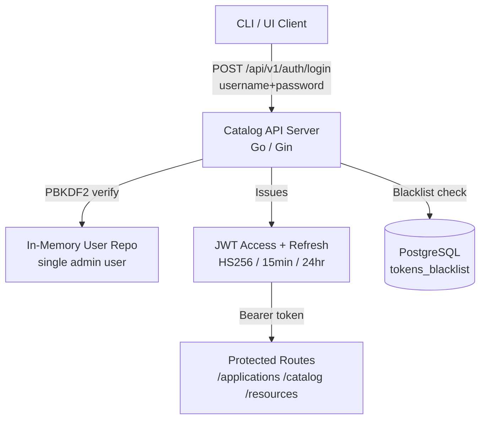
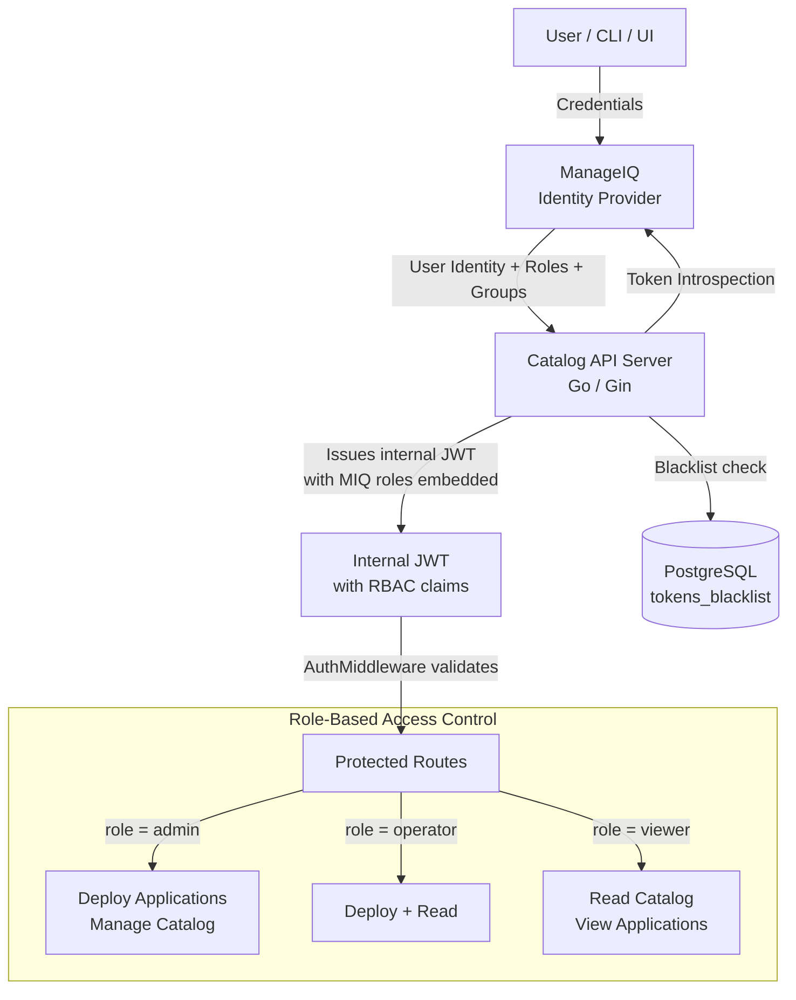
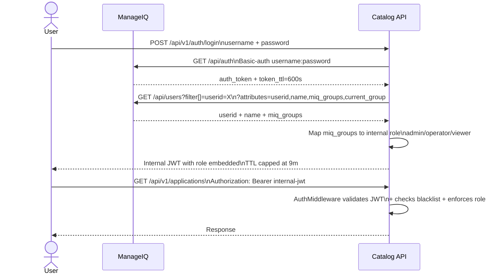
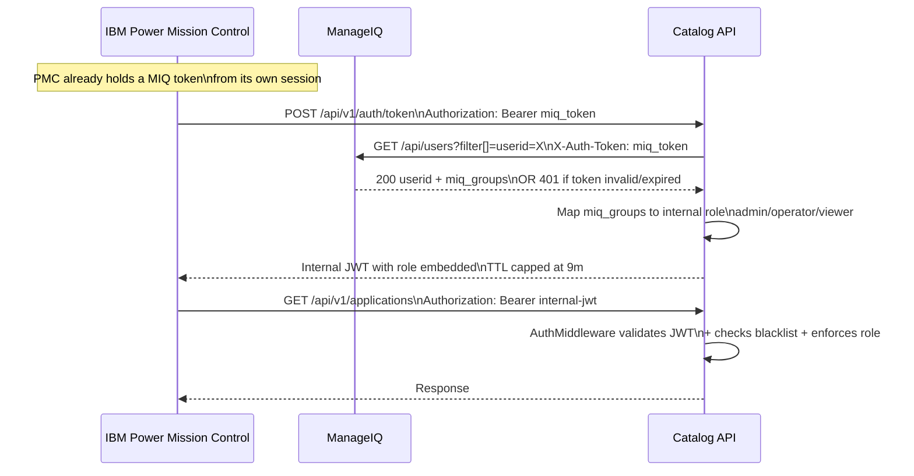
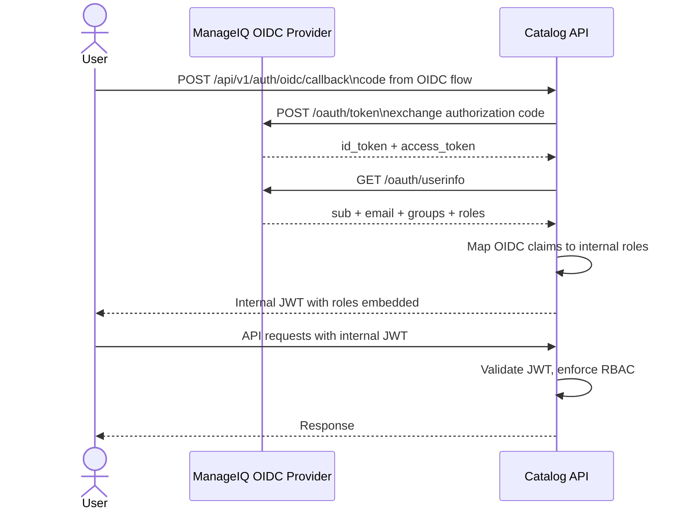
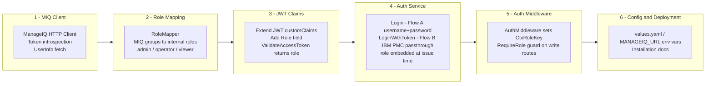
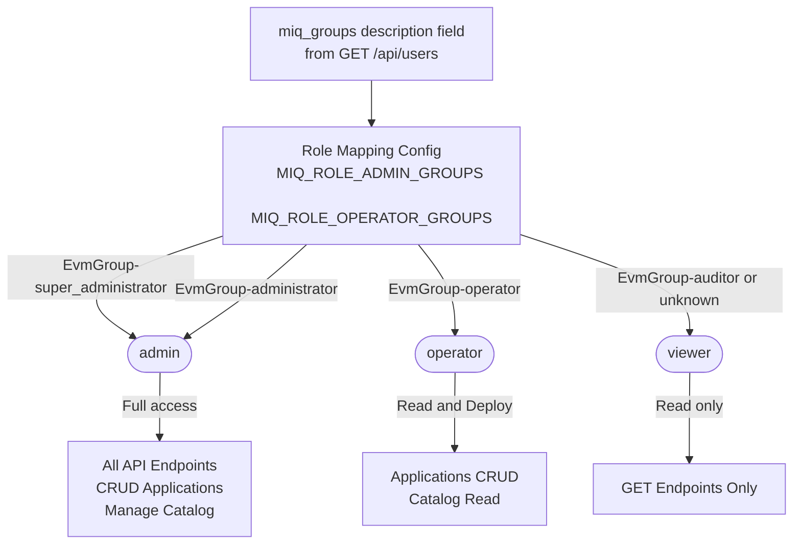

# ManageIQ AuthN/AuthZ Integration Plan

## Top-Level Overview

**Goal:** Replace the current single-admin in-memory authentication in the Catalog API Server with
ManageIQ as the authoritative Identity Provider (IdP). Two authentication flows are supported:

- **Flow A — Interactive login:** A user supplies username + password; the Catalog API authenticates against ManageIQ, fetches their groups, and issues an internal JWT.
- **Flow B — ManageIQ token passthrough:** An external product such as **IBM Power Mission Control** already holds a ManageIQ token from its own session and sends it directly to the Catalog API. The Catalog API validates the token against ManageIQ, resolves the identity and groups, and issues an internal JWT. IBM Power Mission Control does nothing beyond forwarding the token.

**Scope:**
- Go Catalog API Server (`ai-services/internal/pkg/catalog/`)
- A new ManageIQ HTTP client package
- Extended JWT claims (roles, group membership)
- New role-based route guards in Gin middleware
- New `POST /api/v1/auth/token` endpoint for the token passthrough flow (Flow B)

**Non-Goals:**
- Python AI services (chatbot, digitize, similarity) — out of scope for this phase
- Replacing the token blacklist mechanism (it stays PostgreSQL-backed)
- OIDC discovery / full OAuth2 PKCE flow (covered in a follow-on if needed)
- ManageIQ token generation or management — that is IBM Power Mission Control's responsibility

**Integration Strategy (Phase 1):** Two-call Token Introspection
Both flows converge on the same two MIQ API calls for identity resolution (validated against
`https://9.20.202.144:8443`, API v4.4.0-pre):
1. `GET /api/auth` — (Flow A only) validates credentials and returns a bearer token + `token_ttl`
2. `GET /api/users?filter[]=userid=X&expand=resources&attributes=userid,name,miq_groups,current_group` — fetches identity and group membership for role mapping using the MIQ token

Note: `GET /api/auth?requester_type=ui` only echoes a refreshed token; it does **not** return user identity or groups on this version.

---

## Architecture Diagrams

### Current State — Local Admin Authentication

---

### Target State — ManageIQ as Identity Provider

---

### Integration Flow A — Interactive Login

---

### Integration Flow B — IBM Power Mission Control Token Passthrough

IBM Power Mission Control already holds a ManageIQ token from its own session. It forwards
that token as-is to the Catalog API. The Catalog API validates it against ManageIQ, resolves
the identity and groups, and issues an internal JWT. IBM PMC does nothing beyond sending the token.

---

### Integration Flow — OIDC/OAuth2 Phase 2

---

### Architectural Layers Affected

---

### RBAC Role Hierarchy

---

## Sub-Tasks

---

### Sub-Task 1 — ManageIQ HTTP Client Package

**Intent:**  
Encapsulate all communication with ManageIQ into a dedicated, testable Go package. This isolates
ManageIQ API details from the rest of the codebase and makes it easy to swap authentication strategies
(token introspect → OIDC) later.

**Expected Outcomes:**
- New package `internal/pkg/catalog/miq/` with a `Client` interface and concrete HTTP implementation
- `Client.Authenticate(ctx, username, password)` — calls `GET /api/auth` with Basic-auth; returns `AuthResponse{Token, TTL}`
- `Client.GetUser(ctx, miqToken, userID)` — calls `GET /api/users/{id}?attributes=userid,name,miq_groups,current_group`; returns `UserInfo`
- `UserInfo` struct carries `UserName`, `FullName`, `ExternalID`, `Groups []string`, `CurrentGroup string`
- Error type `ErrUnauthorized` mapped from `error.kind == "unauthorized"` and klass `Api::BaseController::Authentication::AuthenticationError`
- `InsecureSkipTLS bool` field on the client (required for self-signed certs like `9.20.202.144`)
- Unit tests using an `httptest` server stub for both API calls

**Todo List:**
1. Create `internal/pkg/catalog/miq/client.go` with the `Client` interface
2. Implement `HTTPClient` struct using `go-resty` (already a project dependency)
3. Add `UserInfo`, `AuthResponse`, and `ErrorResponse` models in `internal/pkg/catalog/miq/models.go`
4. Implement `Authenticate`: `GET /api/auth` with Basic-auth header; parse `auth_token` + `token_ttl`
5. Implement `GetUser`: `GET /api/users/{id}?attributes=userid,name,miq_groups,current_group`; parse `miq_groups[].description` into `Groups`
6. Map HTTP 401 + `error.kind=unauthorized` to `ErrUnauthorized` sentinel error
7. Create `internal/pkg/catalog/miq/client_test.go` with httptest stubs for both endpoints
8. Add `MANAGEIQ_URL` and `MANAGEIQ_INSECURE_SKIP_TLS` to the config package

**Relevant Context:**
- Validated API: `GET /api/auth` (Basic-auth) and `GET /api/users/{id}` on ManageIQ v4.4.0-pre
- `go-resty` client already in `go.mod` at `github.com/go-resty/resty/v2`
- Existing HTTP patterns in `internal/pkg/catalog/client/` can guide the style
- Config loading in `internal/pkg/catalog/config/`
- See `docs/proposals/manageiq-authn-authz-curl-validation.md` for exact request/response shapes

**Status:** `[ ] pending`

---

### Sub-Task 2 — Role Mapping & RBAC Model

**Intent:**  
Define the mapping from ManageIQ group/role names to internal RBAC roles. This mapping must be
configuration-driven so operators can adapt it without code changes.

**Expected Outcomes:**
- New `internal/pkg/catalog/apiserver/models/role.go` with `Role` type and constants: `RoleAdmin`, `RoleOperator`, `RoleViewer`
- A `RoleMapper` that reads a YAML/env-based mapping and translates `[]string` of MIQ groups → `Role`
- Default mapping documented in `values.yaml` and the config package
- Unit tests covering mapping edge cases (no groups, unknown group, multiple groups)

**Todo List:**
1. Define `Role` type and constants in `models/role.go`
2. Create `internal/pkg/catalog/apiserver/services/auth/rolemapper.go` with `MapGroupsToRole(groups []string) Role`
3. Load mapping from environment variables (e.g., `MIQ_ROLE_ADMIN_GROUPS`, `MIQ_ROLE_OPERATOR_GROUPS`)
4. Add defaults using **hyphen format**: `EvmGroup-super_administrator`, `EvmGroup-administrator` → `admin`; `EvmGroup-operator` → `operator`; everything else → `viewer`
5. Write unit tests in `rolemapper_test.go`
6. Document mapping config in `docs/proposals/manageiq-authn-authz-plan.md` (this file)

**Relevant Context:**
- **Validated group name format** (hyphen, not double-colon): `EvmGroup-super_administrator`, `EvmGroup-administrator`, `EvmGroup-operator`, `EvmGroup-auditor`
- Group strings come from `miq_groups[].description` on `GET /api/users/{id}` — not from `/api/auth`
- Existing `models/user.go` for model conventions
- `internal/pkg/catalog/constants/` for constant patterns

**Status:** `[ ] pending`

---

### Sub-Task 3 — Extend JWT Claims with Roles

**Intent:**  
The internal JWT must carry the user's RBAC role so the auth middleware can enforce it without
hitting ManageIQ on every request. The role is embedded at login time and is valid for the token
lifetime.

**Expected Outcomes:**
- `customClaims` in `services/auth/jwt.go` extended with `Role string` field
- `GenerateAccessToken` / `GenerateRefreshToken` accept `role` parameter
- `ValidateAccessToken` returns `(userID, role, expiry, error)`
- Existing callers of token generation updated
- Backward compatibility: tokens without role field treated as `viewer`

**Todo List:**
1. Add `Role string` to `customClaims` struct in `jwt.go`
2. Update `GenerateAccessToken(userID, role string)` and `GenerateRefreshToken(userID, role string)` signatures
3. Update `ValidateAccessToken` to return role alongside userID and expiry
4. Update `AuthMiddleware` to set `CtxRoleKey` in the Gin context alongside `CtxUserIDKey`
5. Update all call sites in `services/auth/service.go`
6. Update unit tests

**Relevant Context:**
- `ai-services/internal/pkg/catalog/apiserver/services/auth/jwt.go` — current `customClaims`
- `ai-services/internal/pkg/catalog/apiserver/middleware/auth.go` — sets `CtxUserIDKey` and `CtxRawTokenKey`
- `ai-services/internal/pkg/catalog/apiserver/services/auth/service.go` — calls `GenerateAccessToken`

**Status:** `[ ] pending`

---

### Sub-Task 4 — MIQ-Backed Auth Service & Login Handler (Flow A)

**Intent:**
Replace the single-admin PBKDF2 password check with a ManageIQ-backed interactive login flow. On
`POST /api/v1/auth/login`, the Catalog API authenticates against ManageIQ using the supplied
username + password, fetches user identity and group membership, maps roles, and issues an internal JWT.

**Expected Outcomes:**
- `auth.Service.Login` delegates to `miq.Client` via two-call flow
- User struct populated from ManageIQ `UserInfo` (no local password storage)
- Role embedded in issued JWT
- Existing `POST /api/v1/auth/login` endpoint signature unchanged (`username` + `password` body)
- Graceful 503 if ManageIQ is unreachable
- `--manageiq-url` and `--manageiq-insecure-tls` CLI flags added to the `catalog apiserver` command

**Todo List:**
1. Add `miqClient miq.Client` to `auth.service` struct
2. Rewrite `service.Login` as a two-call flow:
   - Call `miqClient.Authenticate(ctx, username, password)` → returns `miqToken`
   - Call `miqClient.GetUserByToken(ctx, miqToken)` → returns `UserInfo` with `Groups`
3. Call `RoleMapper.MapGroupsToRole` on `UserInfo.Groups` (hyphen-format group names)
4. Pass role to `GenerateAccessToken` / `GenerateRefreshToken`
5. Wire `miq.Client` in `cmd/catalog/apiserver.go` (read `MANAGEIQ_URL`, `MANAGEIQ_INSECURE_SKIP_TLS` env)
6. Add `--manageiq-url` and `--manageiq-insecure-tls` CLI flags in `cmd/catalog/apiserver.go`
7. Keep `NewInMemoryUserRepo` for the `/auth/me` path — populated from `UserInfo` at login time
8. Integration test: mock ManageIQ (`/api/auth` + `/api/users` stubs) → login → JWT decode → role check

**Relevant Context:**
- `ai-services/cmd/ai-services/cmd/catalog/apiserver.go` — server startup and wiring
- `ai-services/internal/pkg/catalog/apiserver/handlers/auth_handler.go` — `Login` handler
- `ai-services/internal/pkg/catalog/apiserver/services/auth/service.go` — `Login` method
- `ai-services/internal/pkg/catalog/apiserver/repository/user_repo.go` — `InMemoryUserRepo`

**Status:** `[ ] pending`

---

### Sub-Task 4b — IBM Power Mission Control Token Passthrough (Flow B)

**Intent:**
IBM Power Mission Control already holds a ManageIQ session token from its own auth lifecycle and
sends it directly to the Catalog API — it does nothing beyond forwarding the token. The Catalog API
receives the raw MIQ token, validates it against ManageIQ by calling `GET /api/users` with that token
as `X-Auth-Token`, resolves the identity and groups, maps the role, and issues its own internal JWT.
The flow converges on exactly the same identity resolution and JWT issuance path as Flow A.

**Expected Outcomes:**
- New `POST /api/v1/auth/token` endpoint; accepts `Authorization: Bearer <miq_token>` header
- `auth.Service.LoginWithToken(ctx, miqToken string)` added to the `Service` interface
- Implementation calls `miqClient.GetUserByToken(ctx, miqToken)` directly (no `/api/auth` call — the token is already known)
- On valid token: role mapped from `miq_groups`, internal JWT issued — identical shape and TTL to Flow A
- On invalid/expired MIQ token: ManageIQ returns 401 → Catalog API returns 401 to IBM PMC
- No new env vars required — reuses `MANAGEIQ_URL` / `MANAGEIQ_INSECURE_SKIP_TLS`

**Todo List:**
1. Add `GetUserByToken(ctx context.Context, miqToken string) (*UserInfo, error)` to `miq.Client` interface
2. Implement: `GET /api/users?filter[]=userid=X&expand=resources&attributes=userid,name,miq_groups,current_group` with `X-Auth-Token: miqToken`; map HTTP 401 → `ErrUnauthorized`
3. Add `LoginWithToken(ctx context.Context, miqToken string) (access, refresh string, err error)` to `auth.Service` interface
4. Implement `LoginWithToken` in `service.go`: call `GetUserByToken` → `RoleMapper.MapGroupsToRole` → `GenerateAccessToken` / `GenerateRefreshToken` → seed in-memory user repo entry
5. Add `TokenLogin` handler in `auth_handler.go`: read `Authorization: Bearer` header → call `svc.LoginWithToken` → return same JSON shape as `Login`
6. Register `POST /api/v1/auth/token` in `router.go` (no auth middleware — it is itself an auth endpoint)
7. Update Sub-Task 1's `miq.Client` to share `GetUserByToken` between both flows (Flow A calls it after `Authenticate`; Flow B calls it directly)
8. Unit test: stub MIQ `GET /api/users` returning valid user → assert JWT contains correct role
9. Unit test: stub MIQ returning 401 → assert handler returns 401

**Relevant Context:**
- `ai-services/internal/pkg/catalog/apiserver/handlers/auth_handler.go` — `Login` handler as the pattern
- `ai-services/internal/pkg/catalog/apiserver/router.go` — `v1.POST("/auth/login")` registration pattern
- `ai-services/internal/pkg/catalog/apiserver/services/auth/service.go` — `Login` as the service pattern
- curl validation: `GET /api/users?filter[]=userid=admin&expand=resources&attributes=userid,name,miq_groups,current_group` with `X-Auth-Token` header confirmed working against `https://9.20.202.144:8443`

---

### Sub-Task 5 — RBAC Route Guards in Auth Middleware

**Intent:**  
Protect write/destructive endpoints from lower-privileged roles. After Sub-Task 3 embeds the role
in the JWT, the middleware and route groups can enforce `RequireRole(RoleAdmin)` guards on sensitive
operations.

**Expected Outcomes:**
- New `middleware.RequireRole(role models.Role) gin.HandlerFunc` middleware
- Admin-only routes (POST/PUT/DELETE on `/applications`) require `RoleAdmin`
- Read-only routes accessible to `RoleViewer` and above
- 403 Forbidden returned (not 401) when role is insufficient
- Existing health/swagger/auth endpoints unaffected

**Todo List:**
1. Add `RequireRole(minRole Role) gin.HandlerFunc` to `middleware/auth.go`
2. Define role ordering: `viewer < operator < admin`
3. Update `router.go` to apply `RequireRole` after `AuthMiddleware` on write routes:
   - `POST /applications` → `RequireRole(RoleOperator)`
   - `PUT /applications/:id` → `RequireRole(RoleOperator)`
   - `DELETE /applications/:id` → `RequireRole(RoleAdmin)`
4. Return structured JSON error `{"error": "insufficient permissions", "required": "admin"}` on 403
5. Unit tests for middleware with mock Gin contexts at each role level

**Relevant Context:**
- `ai-services/internal/pkg/catalog/apiserver/router.go` — route group definitions
- `ai-services/internal/pkg/catalog/apiserver/middleware/auth.go` — existing `AuthMiddleware`

**Status:** `[ ] pending`

---

### Sub-Task 6 — Configuration & Deployment Updates

**Intent:**
Update deployment configuration (`values.yaml`) to include ManageIQ connection parameters, and
update the documentation so operators know how to configure the integration.

**Expected Outcomes:**
- `values.yaml` extended with `manageiq.url`, `manageiq.insecureTLS`, and role mapping entries
- `docs/INSTALLATION.md` updated with ManageIQ configuration prerequisites
- `.env.example` updated with new variables

**Todo List:**
1. Add `manageiq:` section to `ai-services/assets/catalog/podman/values.yaml`
2. Update `.env.example` with `MANAGEIQ_URL`, `MANAGEIQ_INSECURE_SKIP_TLS`, `MIQ_ROLE_ADMIN_GROUPS`, `MIQ_ROLE_OPERATOR_GROUPS`
3. Add a "ManageIQ Integration" section to `docs/INSTALLATION.md`
4. Update Swagger annotations on auth endpoints to reflect new ManageIQ-backed behavior

**Relevant Context:**
- `ai-services/assets/catalog/podman/values.yaml` — deployment values
- `.env.example` — environment variable template
- `docs/INSTALLATION.md` — operator installation guide

**Status:** `[ ] pending`

---

## Role Mapping Reference

> Group names sourced from `miq_groups[].description` on `GET /api/users/{id}`.
> Format uses a **hyphen separator** (`EvmGroup-name`), validated on ManageIQ v4.4.0-pre.

| ManageIQ Group | Internal Role | Permissions |
|---|---|---|
| `EvmGroup-super_administrator` | `admin` | Full CRUD on all endpoints |
| `EvmGroup-administrator` | `admin` | Full CRUD on all endpoints |
| `EvmGroup-operator` | `operator` | Deploy/update applications; read catalog |
| `EvmGroup-auditor` | `viewer` | Read-only access to all GET endpoints |
| Any other / no group | `viewer` | Read-only access to all GET endpoints |

---

## Configuration Variables Reference

| Variable | Required | Default | Description |
|---|---|---|---|
| `MANAGEIQ_URL` | Yes | — | Base URL of ManageIQ, e.g. `https://9.20.202.144:8443` |
| `MANAGEIQ_INSECURE_SKIP_TLS` | No | `false` | Skip TLS verification — required for self-signed certs |
| `MIQ_ROLE_ADMIN_GROUPS` | No | `EvmGroup-super_administrator,EvmGroup-administrator` | Comma-separated MIQ group descriptions mapped to `admin` |
| `MIQ_ROLE_OPERATOR_GROUPS` | No | `EvmGroup-operator` | Comma-separated MIQ group descriptions mapped to `operator` |
| `AUTH_JWT_SECRET` | No | auto-generated | HMAC-SHA256 secret for internal JWT signing |
| `AUTH_ACCESS_TOKEN_TTL` | No | `9m` | Internal JWT access token lifetime — capped below MIQ token_ttl of 600s |
| `AUTH_REFRESH_TOKEN_TTL` | No | `24h` | Internal JWT refresh token lifetime |

---

## Decision Record

| # | Decision | Rationale |
|---|---|---|
| 1 | Two-call flow over single introspect call | Validated: `/api/auth?requester_type=ui` does not return user identity or groups on v4.4.0-pre; a separate `GET /api/users` call is required |
| 2 | Internal JWT kept | Avoids ManageIQ round-trip on every API call; existing blacklist mechanism is reused unchanged |
| 3 | Role embedded in JWT at login time | Roles are stable per session; keeps the hot path stateless |
| 4 | In-memory user repo kept for `GetUser` | Avoids a MIQ call on `/auth/me`; the repo is populated from `UserInfo` returned at login |
| 5 | `MANAGEIQ_INSECURE_SKIP_TLS` defaults to `false` | Validated instance uses a self-signed cert; production deployments should use valid certs |
| 6 | `AUTH_ACCESS_TOKEN_TTL` default changed from `15m` to `9m` | Validated MIQ `token_ttl` is 600s (10 min); internal JWT must not outlive the MIQ session |
| 7 | Flow B uses a separate endpoint `POST /api/v1/auth/token` | Keeps flows orthogonal; the existing `/auth/login` contract and body schema are unchanged |
| 8 | Flow B skips `/api/auth` — calls `GET /api/users` directly | IBM PMC already holds the MIQ token; there is no need to authenticate again — only validation is needed |
| 9 | `GetUserByToken` is shared by both flows | Flow A calls it after `Authenticate`; Flow B calls it directly — no duplicated identity resolution logic |
| 10 | Python services out of scope | AuthN/AuthZ for Python services is a separate phase; no changes needed there |
