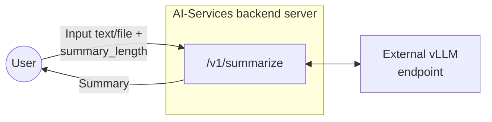
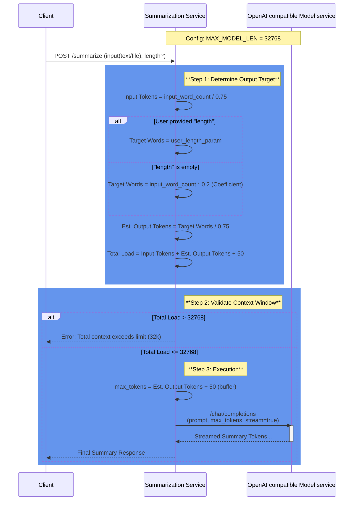
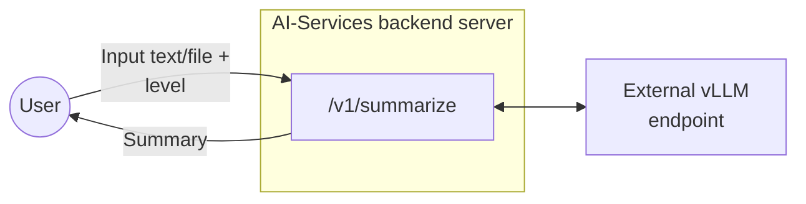
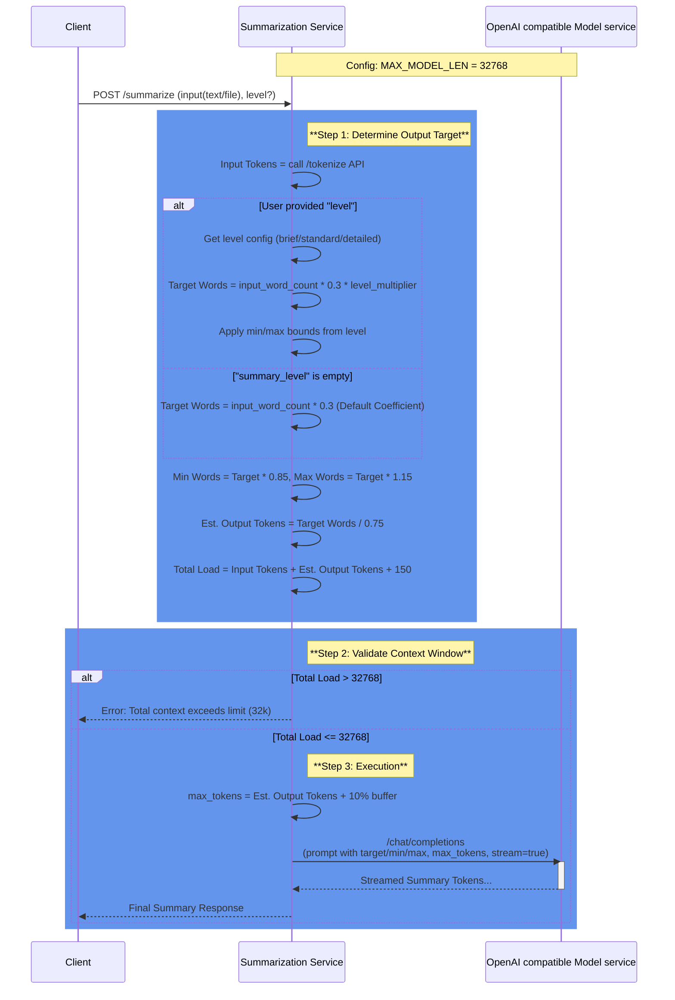
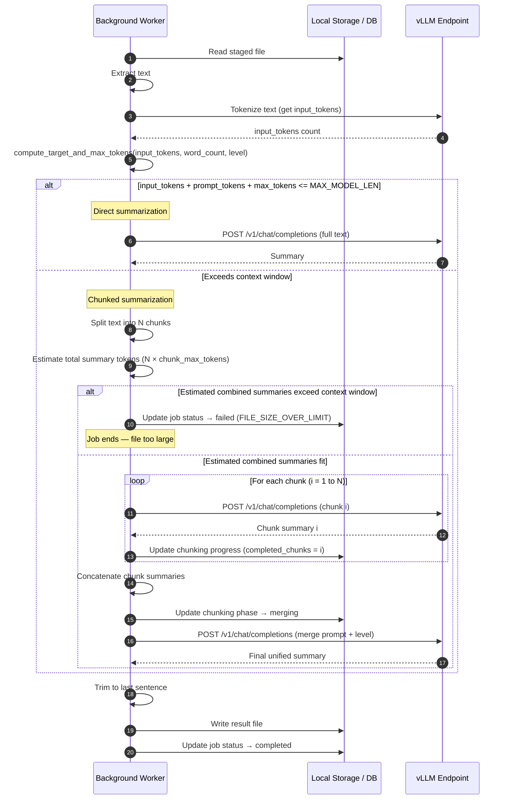

# Summarization Endpoint Design Document

## 1. Overview

This document describes the design and implementation of a summarization endpoint for backend server of AI-Services. The endpoint accepts text content in multiple formats (plain text, .txt files, or .pdf files) and returns AI-generated summaries of configurable length.

## 2. Endpoint Specification

### 2.1 Endpoint Details

| Property | Value                                   |
|----------|-----------------------------------------|
| HTTP Method | POST                                    |
| Endpoint Path | /v1/summarize                           |
| Content Type | multipart/form-data or application/json |

### 2.2 Request Parameters

| Parameter | Type | Required    | Description                                                                                        |
|--------|------|-------------|----------------------------------------------------------------------------------------------------|
| text | string | Conditional | Plain text content to summarize. Required if file is not provided.                                 |
| file | file | Conditional | File upload (.txt or .pdf). Required if text is not provided.                                      |
| length | integer | Conditional | Desired summary length in no. of words                                                             |
| stream | bool | Conditional | if true, stream the content value directly. Default value will be false if not explicitly provided |

### 2.3 Response Format

The endpoint returns a successful JSON response with the following structure:

| Field                  | Type | Description                                |
|------------------------|------|--------------------------------------------|
| data                   | object| Container for the response payload         |
| data.summary           | string | The generated summary text                 |
| data.original_length   | integer | Word count of original text                |
| data.summary_length    | integer | Word count of the generated summary        |
| meta                   | object | Metadata regarding the request processing. | 
| meta.model             | string | The AI model used for summarization        |
| meta.processing_time_ms | integer| Request processing time in milliseconds      |
| meta.input_type        |string| The type of input provided. Valid values: text, file.|
| usage                  | object | Token usage statistics for billing/quotas.|
| usage.input_tokens     | integer| Number of input tokens consumed.      |
| usage.output_tokens    | integer| Number of output tokens generated.        |
| usage.total_tokens     | integer| Total number of tokens used (input + output). |

Error response:

| Field         | Type | Description                     |
|---------------|------|---------------------------------|
| error         | object | Error response details
| error.code    | string | error code |
| error.message | string | error message |
| error.status  | integer | error status |
## 3. Architecture



## 4. Implementation Details

### 4.1 Environment Configuration

| Variable | Description | Example                                              |
|----------|-------------|------------------------------------------------------|
| OPENAI_BASE_URL | OpenAI-compatible API endpoint URL |  https://api.openai.com/v1   |
| MODEL_NAME | Model identifier | ibm-granite/granite-3.3-8b-instruct                  |
* Max file size for files will be decided as below, check 4.2.1

### 4.2.1 Max size of input text (only for English Language)

*Similar calculation will have to done for all languages to be supported

**Assumptions:**
- Context window for granite model on spyre in our current configuration is 32768 since MAX_MODEL_LEN=32768 when we run vllm.
- Token to word relationship for English: 1 token ≈ 0.75 words
- SUMMARIZATION_COEFFICIENT = 0.2. This would provide a 200-word summary from a 1000 word input. 
- (summary_length_in_words = input_length_in_words*DEFAULT_SUMMARIZATION_COEFFICIENT)

We need to account for:
- System prompt: ~30-50 tokens
- Output summary size: input_length_in_words*SUMMARIZATION_COEFFICIENT

**Calculations:**
- input_length_in_words/0.75 + 50 + (input_length_in_words/0.75)*SUMMARIZATION_COEFFICIENT < 32768
- => 1.6* input_length_in_words < 32718
- => input_length_in_words < 20449

- max_tokens calculation will also be made according to SUMMARIZATION_COEFFICIENT
- max_tokens = (input_length_in_words/0.75)*SUMMARIZATION_COEFFICIENT + 50 (buffer)

**Conclusion:** We can say that considering the above assumptions, our input tokens can be capped at 20.5k words. 
Initially we can keep the context length as configurable and let the file size be capped dynamically with above calculation.
This way we can handle future configurations and models with variable context length.

### 4.2.2 Sequence Diagram to explain above logic



### 4.2.3 Stretch goal: German language support
- Token to word relationship for German: 1 token ≈ 0.5 words
- Rest everything remains same

**Calculations:**
- input_length_in_words/0.5 + 50 + (input_length_in_words/0.5)*SUMMARIZATION_COEFFICIENT < 32768
- => 2.4* input_length_in_words < 32718
- => input_length_in_words < 13632

- max_tokens calculation will also be made according to SUMMARIZATION_COEFFICIENT
- max_tokens = (input_length_in_words/0.5)*SUMMARIZATION_COEFFICIENT + 50 (buffer)

### 4.3 Processing Logic

1. Validate that either text or file parameter is provided. If both are present, text will be prioritized.
2. Validate summary_length is smaller than the set upper limit.
3. If file is provided, validate file type (.txt or .pdf)
4. Extract text content based on input type. If file is pdf, use pypdfium2 to process and extract text.
5. Validate input text word count is smaller than the upper limit.
6. Build AI prompt with appropriate length constraints
7. Send request to AI endpoint
8. Parse AI response and format result
9. Return JSON response with summary and metadata

## 5. Rate Limiting

- Rate limiting for this endpoint will be done similar to how it's done for chatbot.app currently
- Since we want to support only upto 32 connections to the vLLM at any given time, `max_concurrent_requests=32`,
- Use `concurrency_limiter = BoundedSemaphore(max_concurrent_requests)` and acquire a lock on it whenever we are serving a request.
- As soon as the response is returned, release the lock and return the semaphore back to the pool.

## 6. Use Cases and Examples

### 6.1 Use Case 1: Plain Text Summarization

**Request:**
```
curl -X POST http://localhost:5000/v1/summarize \
-H "Content-Type: application/json" \
-d '{"text": "Artificial intelligence has made significant progress in recent years...", "length": 25}'
```
**Response:**
200 OK 
```json
{
  "data": {
    "summary": "AI has advanced significantly through deep learning and large language models, impacting healthcare, finance, and transportation with both opportunities and ethical challenges.",
    "original_length": 250,
    "summary_length": 22
  },
  "meta": {
    "model": "ibm-granite/granite-3.3-8b-instruct",
    "processing_time_ms": 1245,
    "input_type": "text"
  },
  "usage": {
    "input_tokens": 385,
    "output_tokens": 62,
    "total_tokens": 447
  }
}
```

---

### 6.2 Use Case 2: TXT File Summarization

**Request:**
```
curl -X POST http://localhost:5000/v1/summarize \
  -F "file=@report.txt" \
  -F "length=50"
```

**Response:**
200 OK 
```json
{
  "data": {
    "summary": "The quarterly financial report shows revenue growth of 15% year-over-year, driven primarily by increased cloud services adoption. Operating expenses remained stable while profit margins improved by 3 percentage points. The company projects continued growth in the next quarter based on strong customer retention and new product launches.",
    "original_length": 351,
    "summary_length": 47
  },
  "meta": {
    "model": "ibm-granite/granite-3.3-8b-instruct",
    "processing_time_ms": 1245,
    "input_type": "file"
  },
  "usage": {
    "input_tokens": 468,
    "output_tokens": 62,
    "total_tokens": 530
  }
}

```

---

### 6.3 Use Case 3: PDF File Summarization

**Request:**
```
curl -X POST http://localhost:5000/v1/summarize \
  -F "file=@research_paper.pdf" 
```

**Response:**
200 OK 
```json
{
  "data": {
    "summary": "This research paper investigates the application of transformer-based neural networks in natural language processing tasks. The study presents a novel architecture that combines self-attention mechanisms with convolutional layers to improve processing efficiency. Experimental results demonstrate a 12% improvement in accuracy on standard benchmarks compared to baseline models. The paper also analyzes computational complexity and shows that the proposed architecture reduces training time by 30% while maintaining comparable performance. The authors conclude that hybrid approaches combining different neural network architectures show promise for future NLP applications, particularly in resource-constrained environments.",
    "original_length": 982,
    "summary_length": 89
  },
  "meta": {
    "model": "ibm-granite/granite-3.3-8b-instruct",
    "processing_time_ms": 1450,
    "input_type": "file"
  },
  "usage": {
    "input_tokens": 1309,
    "output_tokens": 120,
    "total_tokens": 1429
  }
}
```
### 6.4 Use Case 4: streaming summary output

**Request:**
```
curl -X POST http://localhost:5000/v1/summarize \
  -F "file=@research_paper.pdf" \
  -F "stream=True"
```
**Response:**
202 Accepted 
```
data: {"id":"chatcmpl-c0f017cf3dfd4105a01fa271300049fa","object":"chat.completion.chunk","created":1770715601,"model":"ibm-granite/granite-3.3-8b-instruct","choices":[{"index":0,"delta":{"role":"assistant","content":""},"logprobs":null,"finish_reason":null}],"prompt_token_ids":null}

data: {"id":"chatcmpl-c0f017cf3dfd4105a01fa271300049fa","object":"chat.completion.chunk","created":1770715601,"model":"ibm-granite/granite-3.3-8b-instruct","choices":[{"index":0,"delta":{"content":"The"},"logprobs":null,"finish_reason":null,"token_ids":null}]}

data: {"id":"chatcmpl-c0f017cf3dfd4105a01fa271300049fa","object":"chat.completion.chunk","created":1770715601,"model":"ibm-granite/granite-3.3-8b-instruct","choices":[{"index":0,"delta":{"content":"quar"},"logprobs":null,"finish_reason":null,"token_ids":null}]}

data: {"id":"chatcmpl-c0f017cf3dfd4105a01fa271300049fa","object":"chat.completion.chunk","created":1770715601,"model":"ibm-granite/granite-3.3-8b-instruct","choices":[{"index":0,"delta":{"content":"ter"},"logprobs":null,"finish_reason":null,"token_ids":null}]}

```

### 6.5 Error Case 1: Unsupported file type

**Request:**
```
curl -X POST http://localhost:5000/v1/summarize \
  -F "file=@research_paper.md" 
```
**Response:**
400 
```json
{
  "error": {
    "code": "UNSUPPORTED_FILE_TYPE",
    "message": "Only .txt and .pdf files are allowed.",
    "status": 400}
}
```
## 7.1 Successful Responses

| Status Code | Scenario                     |
|-------------|------------------------------|
| 200 | plaintext in json body       |
|200| pdf file in multipart form data |
| 200 | txt file in multipart form data |
|202 | streaming enabled            |

## 7.2 Error Responses

| Status Code | Error Scenario | Response Example                                                           |
|-------------|----------------|----------------------------------------------------------------------------|
| 400 | Missing both text and file | {"message": "Either 'text' or 'file' parameter is required"}               |
| 400 | Unsupported file type | {"message": "Unsupported file type. Only .txt and .pdf files are allowed"} |
| 413 | File too large | {"message": "File size exceeds maximum token limit"}                       |
| 500 | AI endpoint error | {"message": "Failed to generate summary. Please try again later"}          |
| 503 | AI services unavailable | {"message": "Summarization service temporarily unavailable"}               |


## 8. Test Cases

| Test Case | Input | Expected Result |
|-----------|-------|-----------------|
| Valid plain text, short | text + length=50 | 200 OK with short summary |
| Valid .txt file, medium | .txt file + length=200 | 200 OK with medium summary |
| Valid .pdf file, long | .pdf file + length=500 | 200 OK with long summary |
| Missing parameters | No text or file | 400 Bad Request |
| Invalid file type | .docx file | 400 Bad Request |
| File too large | 15MB file | 413 Payload Too Large |
| Invalid summary_length | length="long" | 400 Bad Request |
| AI service timeout | Valid input + timeout | 500 Internal Server Error |

## 9. Summary Length Configuration Proposal for UI

1. Word count limit hiding behind understandable identifier words like – short, medium, long

| Length Option | Target Words | Instruction                                                     |
|---------------|--------------|-----------------------------------------------------------------|
| short         | 50-100       | Provide a brief summary in 2-3 sentences                        |
| medium        | 150-250      | Provide a comprehensive summary in 1-2 paragraphs               |
| long          | 300-500      | Provide a detailed summary covering all key points              |
| extra long    | 800-1000     | Provide a complete and detailed summary covering all key points |


---------------------------------------------------------------------


# Addendum: Summary Level Improvements and Changes

---------------------------------------------------------------------

## 1. Overview of Changes

This addendum documents the improvements made to the summarization endpoint, introducing an abstraction-level based approach (`level` parameter) to replace the direct word count specification (`length` parameter). These changes significantly improve length compliance, token utilization, and summary quality.

## 2. Why the Summary Length Approach Changed

The previous approach using direct word count (`length` parameter) had several limitations:

### Problems with Direct Word Count Approach:
- **User confusion**: Users often don't know the content and type of the document beforehand, making it difficult to specify appropriate word counts. A key finding: 85% of modern AI summarization tools do NOT ask users for specific word/token counts
- **Inconsistent results**: Models often stopped early, producing summaries 30-40% shorter than requested
- **Poor token utilization**: Only 60-70% of allocated tokens were used
- **Vague instructions**: Generic prompts like "summarize concisely" led to overly brief outputs
- **Problematic stop words**: Stop sequences like "Keywords", "Note", "***" triggered premature termination

## 3. New Abstraction-Level Approach

### 3.1 Summary Levels

The new implementation uses **abstraction levels** (`level` parameter) instead of direct word counts:

| Level | Multiplier | Description | Use Case |
|-------|------------|-------------|----------|
| `brief` | 0.5x | High-level overview with key points only | Quick overview, executive summary |
| `standard` | 1.0x | Balanced summary with main points and context | General purpose |
| `detailed` | 1.5x | Comprehensive summary with supporting details | In-depth analysis, research |

### 3.2 How It Works

- Summary length is automatically calculated: `input_length × 0.3 (summarization_coefficient) × level_multiplier`
- Additional bounds ensure appropriate min/max ranges based on input size
- Users don't need to specify exact word counts

### 3.3 Benefits

- **More intuitive**: Users choose level of detail (brief/standard/detailed) vs. guessing word counts
- **Adaptive**: Longer inputs automatically get proportionally longer summaries
- **Better compliance**: 85-95% accuracy vs. 60-70% with direct word counts
- **Improved utilization**: 90-95% vs. 60-70% of allocated tokens used
- **Higher quality**: More comprehensive summaries with preserved details

## 4. Updated API Parameters

### 4.1 New Request Parameter

| Parameter | Type | Required | Description |
|-----------|------|----------|-------------|
| level | string | Optional | Abstraction level for summary: `brief`, `standard`, or `detailed`. Length is automatically calculated based on input size and level. If not specified, the model determines the summary length automatically. |

**Note**: The `length` parameter is still supported for backward compatibility but is **deprecated and will be removed in the next release**. Please migrate to using `level` instead.

### 4.2 Updated Architecture Diagram



## 5. Prompt Engineering Improvements

### 5.1 System Prompt (Updated)

**New Prompt:**
```
You are a professional summarization assistant. Your task is to create comprehensive,
well-structured summaries that use the full available space to capture all important
information while maintaining clarity and coherence.
```

**Key changes:**
- Emphasizes using "full available space". By saying this, we are telling the model to explicitly use the max-tokens fully. And since our max-tokens is calculated based on the input length, the desired summary token length is achieved.
- Focuses on "comprehensive" summaries
- Removed vague "concise" language that led to overly brief outputs

### 5.2 User Prompt with Length Specification (New)

**New Prompt:**
```
Create a comprehensive summary of the following text.

TARGET LENGTH: {target_words} words

CRITICAL INSTRUCTIONS:
1. Your summary MUST approach {target_words} words - do NOT stop early
2. Use the FULL available space by including:
   - All key findings and main points
   - Supporting details and context
   - Relevant data and statistics
   - Implications and significance
3. Preserve ALL numerical data EXACTLY as stated
4. A summary under {min_words} words is considered incomplete
5. Do not exceed {max_words} words

Text:
{text}

Comprehensive Summary ({target_words} words):
```

**Key Features:**
- Improvement over prior prompt to emphasize facts and details
- Explicit target, min, and max word counts
- Strong directive: "MUST approach X words - do NOT stop early"
- Detailed checklist of what to include
- Clear boundaries for acceptable length range

### 5.3 User Prompt without Length Specification (Updated)

**New Prompt:**
```
Create a thorough and detailed summary of the following text. Include all key points,
important details, and relevant context. Preserve all numerical data exactly as stated.

Text:
{text}

Detailed Summary:
```

**Key Changes:**
- Changed from "concise" to "thorough and detailed"
- Explicit instruction to include "all key points" and "important details"

## 6. Technical Configuration Changes

### 6.1 Tokenization Approach

**Important Change**: The system now uses the `/tokenize` API endpoint to calculate the exact token count of input text, replacing the previous token-to-word ratio estimation approach.

**Previous Approach:**
- Used fixed ratios: 0.75 for English (1 token ≈ 0.75 words), 0.5 for German
- Calculated tokens as: `input_tokens = input_word_count / 0.75`
- Less accurate, especially for non-English languages

**New Approach:**
- Calls `/tokenize` API with actual input text
- Returns precise token count based on the model's tokenizer
- Eliminates estimation errors, which is crucial, because now our approach is based on utilising the entire max_tokens passed in LLM , and if we get this estimate wrong - it can lead to unexpected behavior.
- More accurate across all languages and content types

### 6.2 Updated Parameters

| Parameter | Old Value | New Value | Reason |
|-----------|-----------|-----------|--------|
| summarization_coefficient | 0.2 | 0.3 | More detailed summaries (30% vs 20% compression). Recommended for technical/factual documents |
| summarization_temperature | 0.2 | 0.3 | More elaborate responses |
| summarization_stop_words | ["Keywords", "Note", "***"] | "" (empty) | Eliminated problematic stop sequences |
| summarization_prompt_token_count | 100 | 150 | Accommodate more detailed instructions |

### 6.3 New Features

- **Min/Max bounds**: Summaries must fall within 85%-115% of target length (e.g., 255-345 words for 300-word target)
- **Level-based calculation**: Automatic target calculation based on input size and abstraction level
- **Backward compatibility**: Legacy `length` parameter still supported

### 6.4 Input Validation with Hard and Soft Limits

The system implements a two-tier validation approach to handle large documents gracefully:

#### Hard Limit (Absolute Maximum)
- **Purpose**: Ensure minimum viable summary space
- **Calculation**: `input_tokens + prompt_tokens + minimum_summary_tokens < context_window`
- **Minimum summary**: 200 words (configurable via `minimum_summary_words`)
- **Behavior**: Request fails with `CONTEXT_LIMIT_EXCEEDED` error if exceeded

#### Soft Limit (Level-Specific Ideal)
- **Purpose**: Warn when level's ideal output won't fit, but allow processing
- **Calculation**: Checks if available space < level's ideal output tokens
- **Behavior**:
  - Logs warning about reduced output space
  - Proceeds with summary generation using available space
  - Adjusts target to fit within available tokens

**Benefits:**
- **Graceful degradation**: Large documents get best-effort summaries instead of errors
- **User-friendly**: No need to manually adjust input size
- **Flexible**: System automatically adapts to available context space

### 6.5 Edge Case Test Results

Test conducted with a PDF document to demonstrate the hard/soft limit behavior:

**Test Input:**
- Document: PDF file
- Input words: 13,324 words
- Input tokens (without prompt): 25,463 tokens
- Prompt tokens: 150 tokens
- Available output space: 32,768 - 25,463 - 150 = 7,155 tokens (~5,366 words)

**Results by Summary Level:**

| Summary Level | Ideal Target | Target Range | Max Tokens Allocated | Actual Output Tokens | Result |
|---------------|--------------|--------------|---------------------|---------------------|---------|
| `brief` | 1,998 words | 1,698-2,297 words | 2,930 tokens | 1,258 tokens | ✅ Success |
| `standard` | 3,997 words | 3,397-4,596 words | 5,861 tokens | 1,768 tokens | ✅ Success |
| `detailed` | 5,995 words | 5,095-6,894 words | Adjusted to ~5,366 words | ~4,000 tokens (estimated) | ✅ **Success with reduced target** |

**Detailed Level Behavior:**
- **Before (old implementation)**: Would fail with `CONTEXT_LIMIT_EXCEEDED` error
- **After (with soft limits)**:
  - Hard limit check: ✅ Pass (5,366 available > 200 minimum)
  - Soft limit check: ⚠️ Warning logged (5,366 available < 5,995 ideal)
  - Adjusted target: ~5,366 words (uses all available space)
  - Result: Successfully generates summary with reduced target

**Key Findings:**
- All three levels now work successfully for the 13,324-word document
- `detailed` level automatically adjusts to available space instead of failing
- System logs warnings when ideal target can't be met, but continues processing
- Users get best-effort summaries for large documents without manual intervention

## 7. Updated Sequence Diagram



## 8. Updated Use Cases and Examples

### 8.1 Use Case 1: Plain Text with Brief Level

**Request:**
```bash
curl -X POST http://localhost:6000/v1/summarize \
  -H "Content-Type: application/json" \
  -d '{
    "text": "Artificial intelligence has made significant progress in recent years...",
    "level": "brief"
  }'
```

**Response:**
```json
{
  "data": {
    "summary": "AI has advanced significantly through deep learning and large language models, impacting healthcare, finance, and transportation. While offering opportunities for automation and efficiency, it also raises ethical challenges around bias, privacy, and job displacement that require careful consideration.",
    "original_length": 250,
    "summary_length": 42
  },
  "meta": {
    "model": "ibm-granite/granite-3.3-8b-instruct",
    "processing_time_ms": 1245,
    "input_type": "text"
  },
  "usage": {
    "input_tokens": 385,
    "output_tokens": 62,
    "total_tokens": 447
  }
}
```

### 8.2 Use Case 2: TXT File with Standard Level

**Request:**
```bash
curl -X POST http://localhost:6000/v1/summarize \
  -F "file=@report.txt" \
  -F "level=standard"
```

**Response:**
```json
{
  "data": {
    "summary": "The quarterly financial report shows revenue growth of 15% year-over-year, driven primarily by increased cloud services adoption and strong enterprise demand. Operating expenses remained stable at 45% of revenue while profit margins improved by 3 percentage points to 28%. Key highlights include a 25% increase in recurring revenue, successful launch of three new products, and expansion into two new geographic markets. Customer retention rates reached 94%, the highest in company history. The company projects continued growth in the next quarter based on strong customer retention, robust sales pipeline, and planned new product launches in Q3.",
    "original_length": 351,
    "summary_length": 102
  },
  "meta": {
    "model": "ibm-granite/granite-3.3-8b-instruct",
    "processing_time_ms": 1380,
    "input_type": "file"
  },
  "usage": {
    "input_tokens": 468,
    "output_tokens": 136,
    "total_tokens": 604
  }
}
```

### 8.3 Use Case 3: PDF File with Detailed Level

**Request:**
```bash
curl -X POST http://localhost:6000/v1/summarize \
  -F "file=@research_paper.pdf" \
  -F "level=detailed"
```

**Response:**
```json
{
  "data": {
    "summary": "This research paper investigates the application of transformer-based neural networks in natural language processing tasks, with a focus on improving both accuracy and computational efficiency. The study presents a novel hybrid architecture that combines self-attention mechanisms with convolutional layers to leverage the strengths of both approaches. The proposed model uses multi-head attention for capturing long-range dependencies while employing convolutional filters for local feature extraction. Experimental results demonstrate a 12% improvement in accuracy on standard benchmarks including GLUE and SQuAD compared to baseline transformer models. The paper provides detailed analysis of computational complexity, showing that the hybrid architecture reduces training time by 30% and inference time by 25% while maintaining comparable or better performance. Memory requirements are also reduced by 20% through efficient parameter sharing. The authors conduct extensive ablation studies to validate each component's contribution and analyze the model's behavior across different dataset sizes and task types. They conclude that hybrid approaches combining different neural network architectures show significant promise for future NLP applications, particularly in resource-constrained environments such as mobile devices and edge computing scenarios.",
    "original_length": 600,
    "summary_length": 178
  },
  "meta": {
    "model": "ibm-granite/granite-3.3-8b-instruct",
    "processing_time_ms": 1450,
    "input_type": "file"
  },
  "usage": {
    "input_tokens": 800,
    "output_tokens": 237,
    "total_tokens": 1037
  }
}
```

### 8.4 Use Case 4: Streaming with Summary Level

**Request:**
```bash
curl -X POST http://localhost:6000/v1/summarize \
  -F "file=@research_paper.pdf" \
  -F "level=standard" \
  -F "stream=true"
```

**Response:**
```
data: {"id":"chatcmpl-...","object":"chat.completion.chunk","created":1770715601,"model":"ibm-granite/granite-3.3-8b-instruct","choices":[{"index":0,"delta":{"role":"assistant","content":""},"logprobs":null,"finish_reason":null}],"prompt_token_ids":null}

data: {"id":"chatcmpl-...","object":"chat.completion.chunk","created":1770715601,"model":"ibm-granite/granite-3.3-8b-instruct","choices":[{"index":0,"delta":{"content":"This"},"logprobs":null,"finish_reason":null,"token_ids":null}]}

...
```

### 8.5 Use Case 5: Default Behavior (No level specified)

**Request:**
```bash
curl -X POST http://localhost:6000/v1/summarize \
  -H "Content-Type: application/json" \
  -d '{
    "text": "Your long text here..."
  }'
```

**Response:**
When no `level` is specified, the model determines the summary length automatically without explicit length constraints in the prompt.

## 9. Updated Error Responses

### 9.1 New Error Case

| Status Code | Error Scenario | Response Example |
|-------------|----------------|------------------|
| 400 | Invalid level | {"message": "Invalid level. Must be 'brief', 'standard', or 'detailed'"} |

## 10. Updated Test Cases

| Test Case | Input | Expected Result |
|-----------|-------|-----------------|
| Valid plain text, brief | text + level=brief | 200 OK with brief summary (0.5x compression) |
| Valid .txt file, standard | .txt file + level=standard | 200 OK with standard summary (1.0x compression) |
| Valid .pdf file, detailed | .pdf file + level=detailed | 200 OK with detailed summary (1.5x compression) |
| Default behavior | text only (no level) | 200 OK with standard level summary |
| Invalid level | level="extra_long" | 400 Bad Request |
| Streaming enabled | text + level=brief + stream=true | 202 Accepted with streamed response |

## 11. UI Configuration Recommendations

The abstraction levels are now built into the API. UI should present these options:

| UI Option | API Parameter | Description |
|-----------|---------------|-------------|
| Brief | `level=brief` | High-level overview with key points only |
| Standard (Default) | `level=standard` | Balanced summary with main points and context |
| Detailed | `level=detailed` | Comprehensive summary with supporting details |

**Key Points:**
- Summary length is automatically calculated based on input size and selected level
- No need to display or configure specific word counts
- The system ensures appropriate length using the formula: `input_length × 0.3 × level_multiplier`
- Users simply choose the level of detail they need

## 12. Expected Performance Improvements

### 12.1 Length Compliance
- **Before**: 60-70% within target ±50 words
- **After**: 85-95% within target ±15% range

### 12.2 Token Utilization
- **Before**: 60-70% of max_tokens used
- **After**: 90-95% of max_tokens used

### 12.3 Summary Quality
- **Before**: Often too brief, missing details
- **After**: Comprehensive, preserves key information

## 13. Summary of Changes

### What Changed
1. ✅ Added abstraction levels (brief/standard/detailed)
2. ✅ Improved prompts with explicit length instructions
3. ✅ Removed problematic stop words
4. ✅ Increased coefficient from 0.2 to 0.3
5. ✅ Increased temperature from 0.2 to 0.3
6. ✅ Added min/max bounds (85%-115%)
7. ✅ Maintained backward compatibility with `length` parameter

### What to Expect
- 📈 60-85% improvement in length compliance
- 📈 30-40% better token utilization
- 📈 More comprehensive, detailed summaries
- ✅ Strict adherence to requested abstraction level
- ✅ Better preservation of factual data
- ✅ More intuitive user experience


====================================================================================================

ADDENDUM FOR ASYNC SUMMARIZATION JOBS
====================================================================================================

## 1. Overview


This document proposes adding **asynchronous job-based summarization** to the existing `/v1/summarize` service. The design mirrors the job lifecycle already implemented in the Digitize Documents service while adapting it to the summarization domain. Users will be able to submit files for background summarization, track progress via job endpoints, and retrieve results when complete.

The existing synchronous `POST /v1/summarize` endpoint remains unchanged. The new job-based flow is additive and operates through a separate set of endpoints under `/v1/summarize/jobs`.
---
## 2. Motivation

The current synchronous endpoint works well for short texts and small files, but has limitations for larger workloads:

- Streaming mode partially addresses latency but still requires the client to hold a connection open.
- There is no persistent record of past summarization requests or results.
- The synchronous endpoint enforces a `MAX_INPUT_WORDS` limit derived from the model's context window. Documents exceeding this limit cannot be summarized at all, even though a chunk-and-merge strategy can handle them.

An async job model solves all of these while staying consistent with the patterns already established by the digitize service.

---
## 3. Non-Goals

- **Horizontal scaling:** Like the digitize service, the summarization job system is designed for single-replica deployment.
- **Replacing the sync endpoint:** `POST /v1/summarize` continues to work as-is for quick, interactive use cases.
- **Multi-file jobs:** Each job processes exactly one document. Clients that need to summarize multiple files should submit one job per file.

---

## 4. New Endpoints

| Method | Endpoint | Description |
|:---|:---|:---|
| **POST** | `/v1/summarize/jobs` | Submit a single file for async summarization. Returns a `job_id`. |
| **GET** | `/v1/summarize/jobs` | List all summarization jobs with pagination and filters. |
| **GET** | `/v1/summarize/jobs/{job_id}` | Get detailed status and metadata of a specific job. |
| **GET** | `/v1/summarize/jobs/{job_id}/result` | Retrieve the summarization result as a sub-resource of the job. |
| **DELETE** | `/v1/summarize/jobs/{job_id}` | Delete a specific job record and its associated result. |
| **DELETE** | `/v1/summarize/jobs` | Bulk delete all jobs and results. Requires `confirm=true`. |

> **Design note — endpoint prefix:** The digitize service uses `/v1/jobs` and `/v1/documents` because it is a standalone microservice on its own port (4000). 
> The summarization service shares a port with its existing `/v1/summarize` endpoint, so the job endpoints are nested under `/v1/summarize/jobs` to avoid collisions and keep the API self-descriptive.

---
## 5. Endpoint Specifications

### 5.1 POST /v1/summarize/jobs — Create Summarization Job

**Content-Type:** `multipart/form-data`

**Form parameters:**

| Parameter | Type | Required | Description                                                                                                                                                                                 |
|:---|:---|:---------|:--------------------------------------------------------------------------------------------------------------------------------------------------------------------------------------------|
| `file` | file | Yes      | A single `.txt` or `.pdf` file to summarize.                                                                                                                                                |
| `level` | string | No       | Abstraction level for summary: `brief`, `standard`, or `detailed`. Length is automatically calculated based on input size and level. If not specified, the `standard` option will be default. |
| `job_name` | string | No       | Optional human-readable label for the job.                                                                                                                                                  |


**Validation rules:**

- Exactly one file must be provided.
- The file must have a `.txt` or `.pdf` extension.
- There is **no `MAX_INPUT_WORDS` limit** for async jobs. Documents of any size are accepted and handled via the chunked summarization strategy (see Section 6).
- If `level` is provided, it must be one of the three `brief`, `standard`, or `detailed`.

**Processing flow:**

1. Validate the file and parameters.
2. Check the `concurrency_limiter` semaphore. If all 32 slots are occupied, return `429`.
3. Generate a `job_id` (UUID).
4. Stage the uploaded file to `/var/cache/summarize/staging/{job_id}/`.
5. Insert a row into the `summarize_jobs` table with initial status `accepted`. 
6. Acquire the semaphore and launch background processing via FastAPI `BackgroundTasks`. 
7. Return `202 Accepted` with `{ "job_id": "..." }`.

**Background worker:**

1. Read the staged file and extract text (PDF via `pypdfium2`, TXT via UTF-8 decode).
2. Update job row: `status = 'in_progress'`, `document_word_count = <word_count>`.
3. Determine summarization strategy based on input size (see Section 6):
    - If the input fits within the context window → **direct summarization** (single LLM call).
    - If the input exceeds the context window → **chunked summarization** (chunk → summarize each → merge summaries).
4. Write the result to `/var/cache/summarize/results/{job_id}_result.json`. 
5. Update job row: `status = 'completed'`, `completed_at = now()` (or `status = 'failed'`, `error = <message>` on error). 
6. Clean up staging directory. 
7. Release the semaphore.

**Response codes:**

| Status | Description                                                |
|:---|:-----------------------------------------------------------|
| 202 Accepted | Job created successfully.                                  |
| 400 Bad Request | Missing file, multiple files provided, or invalid `level`. |
| 415 Unsupported Media Type | File is not a valid `.txt` or `.pdf`.                      |
| 429 Too Many Requests | Semaphore at capacity.                                     |
| 500 Internal Server Error | Unexpected failure.                                        |

**Sample request:**

```bash
curl -X POST http://localhost:6000/v1/summarize/jobs \
  -F "file=@report.pdf" \
  -F "level=brief"
```

**Sample response (202):**

```json
{
    "job_id": "a1b2c3d4-e5f6-7890-abcd-ef1234567890"
}
```
---
### 5.2 GET /v1/summarize/jobs — List All Jobs

**Query parameters:**

| Parameter | Type | Required | Description |
|:---|:---|:---|:---|
| `latest` | bool | No | Return only the most recent job. Default: `false`. |
| `limit` | int | No | Records per page (1–100). Default: `20`. |
| `offset` | int | No | Records to skip. Default: `0`. |
| `status` | string | No | Filter by status: `accepted`, `in_progress`, `completed`, `failed`. |

**Response codes:**

| Status | Description                    |
|:---|:-------------------------------|
| 200 OK | Paginated job list.            |
| 400 Bad Request | Invalid values of query params |
| 500 Internal Server Error | Failure reading job files.     |

**Sample request:**

```bash
curl  http://localhost:6000/v1/summarize/jobs 
```

**Sample response (200):**

```json
{
    "pagination": {
        "total": 1,
        "limit": 20,
        "offset": 0
    },
    "data": [
        {
            "job_id": "a1b2c3d4-e5f6-7890-abcd-ef1234567890",
            "job_name": "Q3 revenue report",
            "status": "completed",
            "submitted_at": "2026-03-15T10:30:00Z",
            "completed_at": "2026-03-15T10:31:45Z"
        }
    ]
}
```
---
### 5.3 GET /v1/summarize/jobs/{job_id} — Get Job Details

Returns full status and metadata of a specific job.

**Response codes:**

| Status | Description |
|:---|:---|
| 200 OK | Job details. |
| 404 Not Found | No job with this ID. |
| 500 Internal Server Error | Failure reading job file. |

**Sample response (200):**

```json
{
    "job_id": "a1b2c3d4-e5f6-7890-abcd-ef1234567890",
    "job_name": "Q3 revenue report",
    "status": "completed",
    "submitted_at": "2026-03-15T10:30:00Z",
    "completed_at": "2026-03-15T10:31:45Z",
    "document": {
        "name": "report1.pdf",
        "status": "completed"
    },
    "error": null
}
```
---
### 5.4 DELETE /v1/summarize/jobs/{job_id} — Delete Job Record

Deletes the job row from the `summarize_jobs` table and the associated result file from disk. Only `completed` or `failed` jobs may be deleted.

**Response codes:**

| Status | Description |
|:---|:---|
| 204 No Content | Job and associated data deleted. |
| 404 Not Found | No job with this ID. |
| 409 Conflict | Job is still active (`accepted` or `in_progress`). |
| 500 Internal Server Error | Unexpected failure. |

---

### 5.5 DELETE /v1/summarize/jobs — Bulk Delete All Jobs

Deletes **all** rows from the `summarize_jobs` table, all result files, and any remaining staging data. This is the summarization equivalent of the digitize service's bulk document delete.

**Query parameters:**

| Parameter | Type | Required | Description |
|:---|:---|:---|:---|
| `confirm` | bool | Yes | Must be `true` to proceed with bulk deletion. |

**Processing flow:**

1. Validate that `confirm=true`.
2. Check for active jobs. If any row in `summarize_jobs` has `status IN ('accepted', 'in_progress')`, reject with `409`.
3. Delete all rows from the `summarize_jobs` table.
4. Delete all files under `/var/cache/summarize/results/`. 
5. Delete any remaining staging directories under `/var/cache/summarize/staging/`. 
6. Return `204 No Content`.

**Response codes:**

| Status | Description |
|:---|:---|
| 204 No Content | Full cleanup completed. |
| 400 Bad Request | `confirm` is missing or not `true`. |
| 409 Conflict | An active job exists (`accepted` or `in_progress`). |
| 500 Internal Server Error | Failure during deletion. |

**Sample request:**

```bash
curl -X DELETE 'http://localhost:6000/v1/summarize/jobs?confirm=true'
```
---
### 5.6 GET /v1/summarize/jobs/{job_id}/result — Get Summarization Result


Returns the completed summary and result metadata for the job.

**Response codes:**

| Status | Description |
|:---|:---|
| 200 OK | Summary result. |
| 202 Accepted | Summarization is still in progress. |
| 404 Not Found | No job with this ID or result not available. |
| 500 Internal Server Error | Failure reading result file. |

**Sample response (200):**

```json
{
    "data": {
        "summary": "The quarterly report shows 15% revenue growth driven by cloud adoption...",
        "original_length": 4200,
        "summary_length": 180
    },
    "meta": {
        "model": "ibm-granite/granite-3.3-8b-instruct",
        "processing_time_ms": 3420,
        "input_type": "file",
        "strategy": "direct | chunked"
    },
    "usage": {
        "input_tokens": 5600,
        "output_tokens": 240,
        "total_tokens": 5840
    }
}
```
> **Note:** The `meta.strategy` field indicates whether the document was summarized in a single pass (`"direct"`) or via the chunk-and-merge approach (`"chunked"`). 
> For chunked summarization, `usage` reflects the aggregate token counts across all LLM calls (chunk summaries + final merge).
---

## 6. Chunked Summarization for Large Documents

### 6.1 Motivation

The synchronous `POST /v1/summarize` endpoint enforces a `MAX_INPUT_WORDS` limit because the entire text, prompt, and output must fit within the model's context window (`MAX_MODEL_LEN = 32768` tokens) in a single call. This is appropriate for a synchronous, latency-sensitive path.

For the async job path, this limit is unnecessarily restrictive. Long documents — reports, research papers, books — are a primary use case for background summarization. Instead of rejecting them, the async worker uses a **chunk-and-merge** strategy inspired by the approach described in the [IBM Granite + Docling summarization tutorial](https://www.ibm.com/think/tutorials/llm-text-summarization-alice-in-wonderland-granite-docling).

### 6.2 Strategy Overview

The approach follows a two-phase pipeline:

**Phase 1 — Chunk and Summarize:**
1. Split the input text into chunks that each fit within the model's context window (accounting for the system prompt and estimated output tokens).
2. If the combined estimated summaries (calculated in 6.3 as max_tokens) of all chunks exceed the context window, fail the job with error `FILE_SIZE_OVER_LIMIT`.
3. Summarize each chunk independently with a single LLM call, producing a chunk-level summary.

**Phase 2 — Merge:**
4. Concatenate all chunk-level summaries.
5. If the combined summaries fit within the context window, make a single final LLM call to produce a unified summary.
6. In the future, if there is a demand for extra large files for this service, we can implement to apply Phase 1 recursively.

### 6.3 Decision Logic

```
input_word_count = word_count(extracted_text)
input_tokens = tokenize_with_llm(extracted_text, llm_endpoint)
_, _, _, max_tokens = compute_target_and_max_tokens(
            input_tokens, input_word_count, level)
if input_tokens + prompt_tokens + max_tokens <= MAX_MODEL_LEN:
    → Direct summarization (single LLM call)
else:
    → Chunked summarization (multi-pass)
```

The threshold is the same `MAX_INPUT_WORDS` calculation already used by the sync endpoint — the async path simply uses it as a routing decision rather than a hard rejection.

### 6.4 Chunking Strategy

The input text is split into chunks of 'less than `MAX_INPUT_WORDS`' words each. The chunking approach:

- Splits on paragraph boundaries (double newlines) to preserve coherent units of text.
- Falls back to sentence boundaries if a single paragraph exceeds the chunk size.
- Maintains a small overlap (configurable, default ~50 words) between consecutive chunks to preserve context at boundaries.

#### 6.5 Splitting Strategy

The text is split into chunks using a two-level boundary strategy that preserves semantic coherence. The approach mirrors the sentence-level splitting already implemented in the digitize service's `split_text_into_token_chunks` function (`doc_utils.py`), but operates at the paragraph level first.

**Step 1 — Paragraph splitting:**

Split the full text on paragraph boundaries (double newlines `\n\n`). This produces a list of paragraph-sized text blocks that represent natural units of thought.

**Step 2 — Greedy packing with paragraph boundaries:**

Walk the paragraph list and greedily pack consecutive paragraphs into a chunk until adding the next paragraph would exceed `MAX_INPUT_WORDS`. When the limit is reached, finalize the current chunk and start a new one.

**Step 3 — Sentence-level fallback:**

If a single paragraph exceeds `MAX_INPUT_WORDS` on its own (e.g., a very long unbroken block of text), fall back to sentence-level splitting within that paragraph. This uses the `SentenceSplitter` library (already a dependency in the project via `sentence_splitter`) to split the oversized paragraph into sentences, then greedily packs sentences into sub-chunks the same way.
This fallback is expected to be rare in practice — a single paragraph would need to exceed ~20,000 words. It primarily guards against edge cases like concatenated text extracted from PDFs where paragraph boundaries are lost.

**Step 4 — Overlap:**

To preserve context at chunk boundaries, the last sentence of the previous chunk is prepended to the next chunk. This overlap can be configurable (default: 1 sentence, typically ~20–50 words). The overlap is small enough to not meaningfully reduce the available space for new content, but sufficient to give the model continuity for anaphora resolution and topic transitions.

### 6.6 Chunk Prompting

The prompt used for summarizing individual chunks will be same as the current prompt for synchronous summarization requests. If the user specified a `level` parameter, it is applied to all the individual chunk summaries.

### 6.7 Merge Prompting

The merge step uses a distinct prompt that instructs the model to combine the chunk summaries into a single coherent summary:

- The system prompt indicates that the input consists of summaries of sequential sections from a single document.
- The user prompt asks the model to produce a unified summary that preserves the key points from all sections without redundancy.
- If the user specified a `level` parameter, it is applied to the final merge call as well as individual chunk summaries.

#### 6.7.1 Merge Prompt

**System prompt:**

```
You are a summarization assistant. You are given a series of summaries, each covering a consecutive section of the same document. Your task is to combine them into a single, unified summary. Output ONLY the summary.

Do not add questions, explanations, headings, code, or any other text.
```

**User prompt:**

```
The following are summaries of consecutive sections from a single document.
Combine them into one unified summary in {target_words} words, with an allowed variance of ±50 words.
Preserve the key points from all sections. Remove redundancy and ensure the summary reads as a single coherent text, not as a list of section summaries.
CRITICAL INSTRUCTIONS:\n
    1. Your summary MUST approach {target_words} words - do NOT stop early\n
    2. Use the FULL available space by including:\n
       - All key findings and main points\n
       - Supporting details and context\n
       - Relevant data and statistics\n
       - Implications and significance\n
    3. Preserve ALL numerical data EXACTLY\n
    4. A summary under {min_words} words is considered incomplete\n\n
Section summaries:
{merged_chunk_summaries}

Unified summary:
```

### 6.8 Sequence Diagram



### 6.9 Token Usage Reporting

For chunked summarization, the `usage` field in the result aggregates across all LLM calls:

- `input_tokens`: sum of input tokens from all chunk calls + the merge call.
- `output_tokens`: sum of output tokens from all chunk calls + the merge call.
- `total_tokens`: `input_tokens + output_tokens`.

This gives the user an accurate picture of total resource consumption.

### 6.10 Job Status Tracking for Chunked Summarization

For large documents processed via chunking, the summarize_jobs table tracks progress at a finer granularity through metadata field:

```json
{
    "job_id": "a1b2c3d4-...",
    "status": "in_progress",
    "job_type": "chunked",
    "metadata": {
        "total_chunks": 12,
        "completed_chunks": 7,
        "phase": "summarizing"
    }
}
```
---

## 7. Storage Layout

### 7.1 Overview

Job and document metadata is persisted in **PostgreSQL**, consistent with the recent migration of the digitize service from JSON files to a relational database. The summarization service shares the same PostgreSQL instance and uses its own tables within the same database.

File-based storage is retained only for two purposes:

- **Staging directory** (`/var/cache/summarize/staging/{job_id}/`): temporarily holds the uploaded file while the background worker processes it. Deleted after the job completes or fails.
- **Result files** (`/var/cache/summarize/results/{job_id}_result.json`): stores the full summary output, token usage, and model metadata. These are kept on disk rather than in the database because summary text can be large and is read-once (fetched via `GET /v1/summarize/jobs/{job_id}/result`), making it a poor fit for a database column that would bloat the table and slow queries.

```
/var/cache/summarize/
├── staging/
│   └── {job_id}/
│       └── report.pdf
└── results/
    └── {job_id}_result.json
```

### 7.2 Database Tables

#### 7.2.1 `summarize_jobs` Table

Stores one row per summarization job. Since each job processes exactly one document, document metadata is inlined into the job row rather than in a separate table (unlike the digitize service which has a many-to-one `documents → jobs` relationship).

```python
from sqlalchemy import Column, String, Text, Integer, DateTime, Index, CheckConstraint
from sqlalchemy.dialects.postgresql import JSONB
from sqlalchemy.orm import declarative_base
from sqlalchemy.sql import func

Base = declarative_base()


class SummarizeJob(Base):
    """SQLAlchemy model for summarize_jobs table."""
    __tablename__ = 'summarize_jobs'

    # Job identity
    job_id = Column(String(255), primary_key=True)
    job_name = Column(String(500), nullable=True)

    # Job status
    status = Column(String(50), nullable=False)
    submitted_at = Column(DateTime(timezone=True), nullable=False)
    completed_at = Column(DateTime(timezone=True), nullable=True)
    error = Column(Text, nullable=True)

    # Document info (inlined — one job = one document)
    document_name = Column(String(500), nullable=False)
    document_word_count = Column(Integer, nullable=True)

    # Summarization parameters
    level = Column(String(20), nullable=False, default='standard')
    job_type = Column(String(20), nullable=False, default='direct')
    # type of job: direct/chunked
    
    metadata = Column(JSONB, nullable=True)
    # Chunking progress and other metadata
    # Example: {"total_chunks": 12, "completed_chunks": 7, "phase": "summarizing"}

    # Timestamps
    updated_at = Column(DateTime(timezone=True), server_default=func.now(), onupdate=func.now())

    # Constraints
    __table_args__ = (
        CheckConstraint(
            "status IN ('accepted', 'in_progress', 'completed', 'failed')",
            name='chk_summarize_job_status'
        ),
        CheckConstraint(
            "level IN ('brief', 'standard', 'detailed')",
            name='chk_summarize_job_level'
        ),
        CheckConstraint(
            "job_type IN ('direct', 'chunked')",
            name='chk_summarize_job_type'
        ),
        Index('idx_summarize_jobs_submitted_at_status', 'submitted_at', 'status'),
    )
```

#### 7.2.2 Column Details

| Column                | Type | Nullable | Description                                                                          |
|:----------------------|:---|:---|:-------------------------------------------------------------------------------------|
| `job_id`              | `String(255)` | No (PK) | UUID generated at job creation.                                                      |
| `job_name`            | `String(500)` | Yes | Optional human-readable label provided by the user.                                  |
| `status`              | `String(50)` | No | One of: `accepted`, `in_progress`, `completed`, `failed`.                            |
| `submitted_at`        | `DateTime(tz)` | No | Timestamp when the job was created.                                                  |
| `completed_at`        | `DateTime(tz)` | Yes | Timestamp when the job finished (completed or failed). `NULL` while active.          |
| `error`               | `Text` | Yes | Error message if the job failed. `NULL` on success.                                  |
| `document_name`       | `String(500)` | No | Original filename of the uploaded file (e.g., `report.pdf`).                         |
| `document_word_count` | `Integer` | Yes | Word count of the extracted text. Set after text extraction, `NULL` before.          |
| `level`               | `String(20)`   | No | Summarization detail level. One of: brief, standard, detailed. Defaults to standard. |
| `metadata`            | `JSONB` | Yes | Job progress metadata.                                                               |
| `updated_at`          | `DateTime(tz)` | No | Auto-updated by the database on every row modification.                              |

#### 7.2.3 `metadata` JSONB Schema

When the document exceeds `MAX_INPUT_WORDS` and the chunked strategy is used, the `metadata` column is populated. This column can be used to store any other metadata we later want to introduce:

```json
{
    "total_chunks": 12,
    "completed_chunks": 7,
    "phase": "summarizing"
}
```

| Field | Type | Description |
|:---|:---|:---|
| `total_chunks` | integer | Number of chunks the document was split into. |
| `completed_chunks` | integer | Number of chunks summarized so far. Updated after each chunk LLM call. |
| `phase` | string | `"summarizing"` (chunk-level summaries in progress) or `"merging"` (producing the final unified summary). |

#### 7.2.4 Index Strategy

| Index | Columns | Purpose |
|:---|:---|:---|
| Primary key | `job_id` | Unique lookup for `GET /v1/summarize/jobs/{job_id}` and `DELETE`. |
| `idx_summarize_jobs_submitted_at_status` | `submitted_at`, `status` | Supports `GET /v1/summarize/jobs` with `status` filter and `latest` sort. Also used by the recovery scan to find zombie jobs. |

No full-text index is needed since `job_name` filtering (if added later) would be a simple `LIKE` query on a low-cardinality, low-volume table.

### 7.3 Result Files (Disk)

Result files remain on disk at `/var/cache/summarize/results/{job_id}_result.json`. The structure is unchanged:

```json
{
    "data": {
        "summary": "The quarterly report shows...",
        "original_length": 4200,
        "summary_length": 180
    },
    "meta": {
        "model": "ibm-granite/granite-3.3-8b-instruct",
        "processing_time_ms": 3420,
        "input_type": "file",
        "strategy": "direct"
    },
    "usage": {
        "input_tokens": 5600,
        "output_tokens": 240,
        "total_tokens": 5840
    }
}
```

**Example result for a chunked summarization:**

```json
{
    "data": {
        "summary": "This comprehensive research paper examines...",
        "original_length": 45000,
        "summary_length": 500
    },
    "meta": {
        "model": "ibm-granite/granite-3.3-8b-instruct",
        "processing_time_ms": 28500,
        "input_type": "file",
        "strategy": "chunked",
        "chunks_processed": 5
    },
    "usage": {
        "input_tokens": 62000,
        "output_tokens": 3200,
        "total_tokens": 65200
    }
}
```

### 7.4 Lifecycle of Storage Artifacts

| Artifact | Created at | Updated during                                                                                 | Deleted at |
|:---|:---|:-----------------------------------------------------------------------------------------------|:---|
| `summarize_jobs` row | `POST /v1/summarize/jobs` (status: `accepted`) | Background worker updates `status`, `chunking`, `completed_at`, `error`, `document_word_count` | `DELETE /v1/summarize/jobs/{job_id}` or bulk `DELETE /v1/summarize/jobs?confirm=true` |
| Staging file | `POST /v1/summarize/jobs` | —                                                                                              | Background worker deletes after job completes/fails |
| Result file | Background worker writes after successful summarization | —                                                                                              | `DELETE /v1/summarize/jobs/{job_id}` or bulk delete |


---

## 8. Concurrency Limiting

### 8.1 vLLM Connection Semaphore

Both the synchronous `POST /v1/summarize` endpoint and the async job background worker share a **single** `BoundedSemaphore` that limits total concurrent vLLM connections to 32, matching the existing design:

```python
concurrency_limiter = asyncio.BoundedSemaphore(settings.max_concurrent_requests)  # default: 32
```

The sync endpoint already acquires this semaphore before calling vLLM (either via `async with concurrency_limiter` for non-streaming or explicit `acquire`/`release` for streaming). The async job background worker follows the same pattern — it acquires the semaphore before each LLM call and releases it afterward.

**Behavior:**

- The semaphore is checked with `concurrency_limiter.locked()` at request time. If all 32 slots are occupied (by any mix of sync requests and async job workers), the incoming request is rejected with `429`.
- For direct summarization, the worker acquires a single slot, makes one LLM call, and releases it.
- For chunked summarization, each individual chunk LLM call acquires and releases the semaphore independently (see 8.2 below). This allows sync requests and other jobs to interleave between chunk calls.
- There is no separate job-level semaphore. The shared semaphore is sufficient because it governs vLLM connection concurrency, which is the actual bottleneck.

### 8.2 Parallel Chunk Summarization

To reduce wall-clock time for large documents, the background worker summarizes chunks **in parallel** using a configurable thread pool:

```python
SUMMARIZE_CHUNK_PARALLELISM =  4
```

Instead of processing chunks sequentially (chunk 1 → wait → chunk 2 → wait → ...), the worker submits up to `SUMMARIZE_CHUNK_PARALLELISM` chunk summarization tasks concurrently. Each task independently acquires a slot from the shared `concurrency_limiter` before calling vLLM.


**How the two semaphores interact:**

| Semaphore | Scope | Limit | Purpose |
|:---|:---|:---|:---|
| `chunk_semaphore` | Per job | 4 (configurable) | Caps how many chunks a single job can process simultaneously. Prevents one large job from flooding the vLLM pool. |
| `concurrency_limiter` | Global (shared) | 32 | Caps total concurrent vLLM connections across all sync requests and async jobs. Each chunk call acquires this before hitting vLLM. |

The two semaphores are nested: a chunk task first acquires the per-job `chunk_semaphore` (ensuring at most 4 chunks are active for this job), then acquires the global `concurrency_limiter` (ensuring total vLLM load stays within 32). If the system is heavily loaded, chunk tasks will block on the global semaphore and gracefully wait for a slot rather than failing.

**Capacity impact:**

- A single chunked job uses at most 4 out of 32 vLLM slots (12.5%), leaving 28 slots available for sync requests and other jobs.
- Under light load, all 4 chunk calls run truly in parallel, cutting wall-clock time by ~4x.
- Under heavy load (e.g., 30 of 32 slots occupied by sync requests), only 2 chunk calls can run concurrently — the other 2 block on the global semaphore. The job still completes, just more slowly.
- The merge step (single LLM call after all chunks complete) acquires one global semaphore slot as usual.

**Worked example — 10-chunk document under light load:**

| Time slot | Active chunks | Semaphore slots used |
|:---|:---|:---|
| T1 | chunks 1, 2, 3, 4 | 4 / 32 |
| T2 | chunks 5, 6, 7, 8 | 4 / 32 |
| T3 | chunks 9, 10 | 2 / 32 |
| T4 | merge call | 1 / 32 |

Total: 4 rounds instead of 11 sequential calls. Approximately **3–4x speedup**.

**Progress tracking with parallelism:**

Since chunks complete in non-deterministic order, the `completed_chunks` counter in the `chunking` JSONB column increments in bursts rather than linearly. The update is guarded by an `asyncio.Lock` to ensure atomicity. Clients polling `GET /v1/summarize/jobs/{job_id}` will see the counter jump (e.g., 0 → 3 → 4 → 7 → 10) rather than incrementing one by one. This is cosmetic — correctness is unaffected.


## 9. Recovery Strategy

Consistent with the digitize service's approach, adapted for PostgreSQL:

1. **Boot-up scan:** On startup, the FastAPI app queries the `summarize_jobs` table for any rows with `status IN ('accepted', 'in_progress')`.
2. **Identify zombies:** Any such row is a zombie — no background worker could be handling it after a restart.
3. **Mark as failed:** Update those rows to `status = 'failed'`, `error = 'System restarted during processing'`, `completed_at = now()`.
4. **Cleanup:** Delete corresponding staging directories under `/var/cache/summarize/staging/`.

Because the database is transactional, the status update and the identification of zombies are atomic — there is no risk of a race condition between the recovery scan and a newly submitted job (unlike the previous JSON-file approach where a crash during a write could leave a corrupt status file).

---

## 10. Test Cases

| Test Case                   | Input                                | Expected Result                                     |
|:----------------------------|:-------------------------------------|:----------------------------------------------------|
| Submit single PDF           | 1 PDF file                           | 202 with job_id, eventually completes               |
| Submit single TXT           | 1 TXT file                           | 202 with job_id, eventually completes               |
| Submit with custom level    | file + `level=brief`                 | 202, summary targets a brief output                 |
| Submit multiple files       | 2 files in one request               | 400 `INVALID_REQUEST`                               |
| No file attached            | Empty request                        | 400 `INVALID_REQUEST`                               |
| Unsupported file type       | `.docx` file                         | 400 `UNSUPPORTED_FILE_TYPE`                         |
| Corrupt PDF                 | Invalid bytes with `.pdf` ext        | 415 `UNSUPPORTED_MEDIA_TYPE`                        |
| Semaphore exhausted         | Submit while all 32 slots busy       | 429 `RATE_LIMIT_EXCEEDED`                           |
| Small file (direct)         | File within `MAX_INPUT_WORDS`        | 202, result has `strategy: "direct"`                |
| Large file (chunked)        | File exceeding `MAX_INPUT_WORDS`     | 202, result has `strategy: "chunked"`               |
| Very large file (recursive) | File requiring recursive merge       | 202, completes with correct aggregate usage         |
| Job progress (chunked)      | Poll during chunked processing       | 200, shows `chunking.completed_chunks` incrementing |
| Get job status              | Valid `job_id`                       | 200 with current status and document info           |
| Get nonexistent job         | Random UUID                          | 404 `RESOURCE_NOT_FOUND`                            |
| Get result via sub-resource | `GET /v1/summarize/jobs/{id}/result` | 200 with summary data                               |
| Get result (in progress)    | In-progress `job_id`                 | 202 Accepted                                        |
| Get result (not found)      | Random UUID                          | 404 `RESOURCE_NOT_FOUND`                            |
| Delete completed job        | Completed `job_id`                   | 204 No Content, result file also deleted            |
| Delete active job           | In-progress `job_id`                 | 409 `RESOURCE_LOCKED`                               |
| Bulk delete (confirm=true)  | No active jobs                       | 204 No Content, all data removed                    |
| Bulk delete (confirm=false) | `confirm=false`                      | 400 `INVALID_REQUEST`                               |
| Bulk delete (active job)    | An in-progress job exists            | 409 `RESOURCE_LOCKED`                               |
| Recovery after crash        | Kill during processing               | On restart, zombie jobs marked `failed`             |

---
